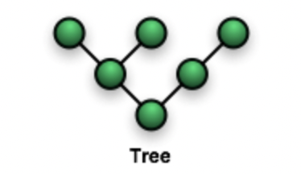
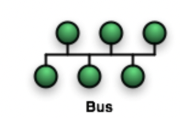
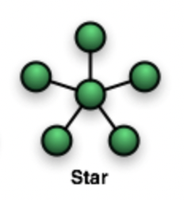
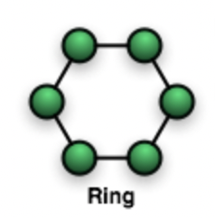
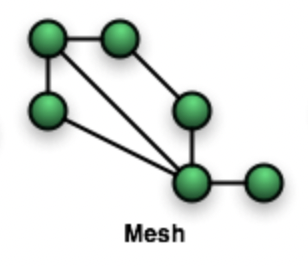

# 2.1.2 네트워크 토폴로지와 병목현상

네트워크 토폴로지(network topology)는 노드와 링크가 어떻게 배치되어 있는지에 대한 방식이자 연결 형태이다.

### | 트리 토폴로지 (tree)



<b> _개념_</b>

부모-자식 계층 구조로 연결되어 있다.

<b> _장점_</b>

노드의 추가, 삭제가 쉽다.

<b> _단점_</b>

특정 노드에 트래픽이 집중될 때, 하위 노드에 영향을 끼칠 수 있다.

### | 버스 토폴로지 (bus)



<b> _개념_</b>

중앙 통신 회선 하나에 여러 개의 노드가 연결되어 공유하는 네트워크 구성이다. (== backbone, linear)

근거리 통신망(LAN)에서 사용한다.

<b> _장점_</b>

비용 효율적이며 소규모 네트워크에 적합하다.

중앙 통신 회선에 노드를 추가하거나 삭제하기가 쉽다.

<b> _단점_</b>

데이터를 전송하는데 하나의 케이블만 쓰기 때문에, 다소 취약한 부분이 있다.

- 케이블에 장애가 발생하는 경우 전체 네트워크가 멈추게 된다.
- 스푸핑이 가능하다.

```
🥸 스푸핑 이란 ?
LAN 상에서 송신부의 패킷을 송신과 관련 없는 다른 호스트에 가지 않도록 하는 스위칭 기능을 마비시키거나 속여서 특정 노드에 해당 패킷이 오도록 처리하는 것을 말한다.
```

### | 스타 토폴로지 (star)



<b> _개념_</b>

중앙에 있는 노드에 모두 연결된 네트워크 구성이다.

<b> _장점_</b>

중앙 허브에서 전체 네트워크를 관리하기 때문에 에러를 탐지하기 쉽고, 패킷의 충돌 발생 가능성이 적다.

각각의 노드는 중앙 허브와 독립적으로 연결되어 있어서, 노드 하나에 장애가 발생하더라도 나머지 네트워크는 영향을 받지 않고 기능한다.

물리적 측면에서 확장 및 축소가 용이하다.

<b> _단점_</b>

중앙 노드에 장애가 발생하면 전체 네트워크를 사용할 수 없다.

설치 비용이 높다.

### | 링 토폴로지 (ring)



<b> _개념_</b>

각각의 노드가 양 옆의 두 노드와 연결되어 전체적으로 고리 처럼 배열되어 있다.

데이터가 원 모양의 네트워크를 따라 한 방향 혹은 양방향으로 흐른다.

<b> _장점_</b>

한 번에 하나의 노드에서만 데이터를 전송할 수 있기 때문에, 패킷이 충돌할 위험이 거의 없다.

네트워크에 잘못된 설정이 있거나 장애가 발생한 경우, 상대적으로 문제를 쉽게 찾을 수 있다.

<b> _단점_</b>

회선에 장애가 발생하면 전체 네트워크에 영향을 크게 끼칠 수 있다.

네트워크 안의 모든 장치가 대역폭을 공유하고 있기 때문에 장치를 추가하면 전반적으로 통신 지연을 일으킬 수 있으며, 노드를 재설정하거나 추가 또는 제거하기 위해서는 전체 네트워크를 중단해야 한다.

### | 메시 토폴로지 (mesh)



<b> _개념_</b>

모든 노드가 그물망 처럼 상호 연결되어 있는 구조이다. ( == 망)

<b> _장점_</b>

한 단말 장치에 장애가 발생해도 여러 개의 경로가 존재하므로, 네트워크를 계속 사용할 수 있다. (높은 안정성)

트래픽의 분산 처리가 가능하다.

<b> _단점_</b>

노드의 추가가 어렵고, 구축 및 운영 비용이 많이 든다.

---

### 병목 현상 (bottleneck)

네트워크 토폴로지가 중요한 이유는 병목 현상을 찾을 때 기준이 되기 때문이다.

```
🥸 병목현상 이란 ?
병목현상은 전체 시스템의 성능이나 용량이 하나의 구성요소로 인해 제한을 받는 현상을 가리킨다.
서비스에서 이벤트를 열었을 때, 트래픽이 많이 생기고 그 트래픽을 잘 관리하지 못하면 병목 현상이 생길 수 있다.
```
