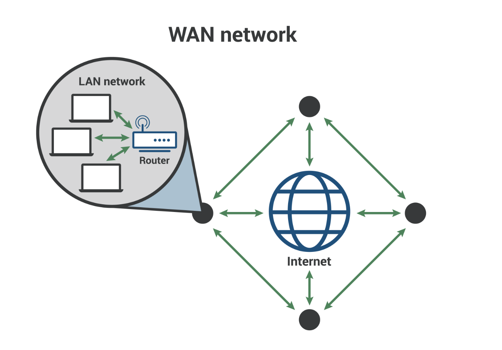

# 2.1.3 네트워크 분류

네트워크는 규모를 기반으로 분류할 수 있다.

사무실과 개인적으로 소유 가능한 규모인 `LAN(local area network)`, 서울시 정도의 규모인 `MAN(metropolitan area network)`, 세계 규모인 `WAN(wide area network)` 으로 나뉜다.

### | 근거리 통신망 (LAN)

근거리 통신망은 작고 지역화된 영역으로, 제한된 네트워크 이다.

홈 wifi나 소규모사업체 네트워크 등이 이에 속한다.

### | MAN

대도시 지역 네트워크를 나타내며, 도시 같은 넓은 지역에서 운영된다.

전송 속도는 평균이며 LAN 보다 혼잡도가 높다.

### | 광역 네트워크 (WAN)

광역 네트워크는 먼 거리에 있는 컴퓨터 그룹을 연결하는 대규모 네트워크이다.

인터넷 자체도 WAN으로 간주된다.
