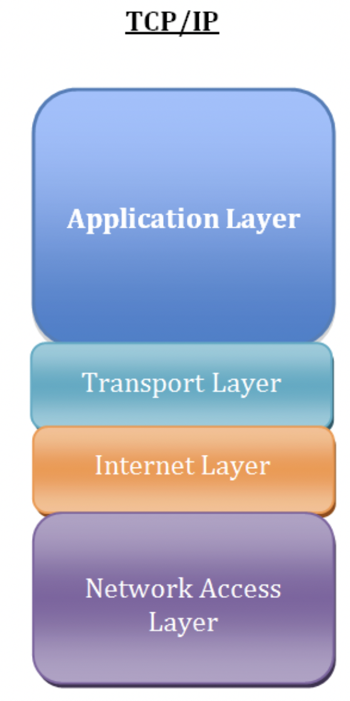
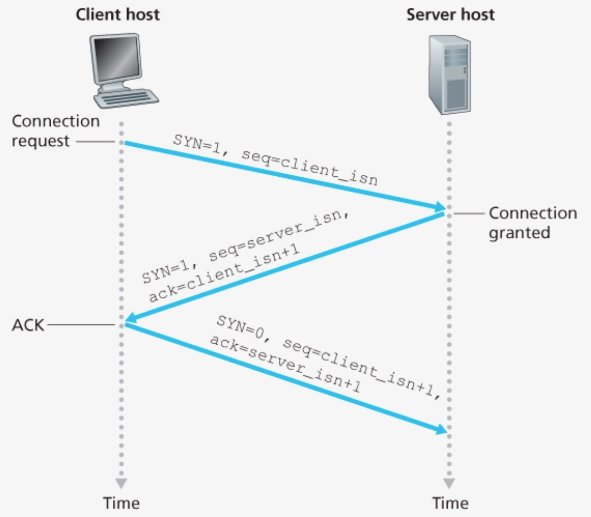

# 2.2.1 TCP/IP의 계층구조

TCP/IP는 네트워크 프로토콜 스위트로, 온라인상의 안전하고 효울적인 데이터 전송의 필수 요건을 정의한다.

`인터넷 프로토콜(IP; Internet Protocol)`은 인터넷의 주소체계로, 소스 장치에서 대상 장치로 정보 패킷을 전달하는 것이 핵심 기능이다. IP는 네트워크 연결이 이루어지는 기본적인 방법이다.

한편, IP는 패킷 순서 지정 또는 오류 검사를 처리하지 않는데, 이러한 기능은 또 다른 프로토콜을 필요로 하며 대개의 경우 `전송제어 프로토콜(TCP; Transmission Control Protocol)`이 그 역할을 한다.

데이터 전송 과정에서 TCP와 IP는 각각 담당하는 작업이 있지만, 결국 같은 결과를 목표로 하기 때문에 한 명칭으로 알려져 있다.

TCP/IP의 각 계층은 프로토콜의 네트워킹 범위에 따라 4개로 나뉜다.



<br />

### | 애플리케이션 계층 (application layer)

해당 프로토콜은 앱에 구축되기 때문에 사용자가 상호작용하기 가장 쉬운 계층이며, 서비스를 실질적으로 사람들에게 제공한다.

- `FTP` : 장치와 장치 간의 파일을 전송하는데 사용되는 표준 통신 프로토콜
- `SSH` : 보안되지 않은 네트워크에서 네트워크 서비스를 안전하게 운영하기 위한 암호하 네트워크 프로토콜
- `HTTP` : www을 이용하기 위한 데이터 통신의 기초이자, 웹 사이트를 이용하는데 쓰는 프로토콜
- `SMTP` : 전자 메일 전송을 위한 인터넷 표준 통신 프로토콜
- `DNS` : 도메인 이름과 IP 주소를 매핑해주는 서버. 이를 통해 IP 주소가 바뀌어도 사용자들에게 똑같은 도메인 주소로 서비스할 수 있다.

<br />

### | 전송 계층 (transport layer)

송신자와 수신자를 연결하는 통신 서비스를 제공하며 연결 지향 데이터 스트림 지원, 신뢰성, 흐름 제어를 제공할 수 있으며 애플리케이션과 인터넷 계층 사이의 데이터가 전달될 때 중계 역할을 한다.

대표적으로 TCP와 UDP가 있다.

`TCP`는 패킷 사이의 순서를 보장하고, 연결지향 프로토콜을 사용하여 수신 여부를 확인하는 '가상회선 패킷 교환 방식'을 사용한다.

- 가상 회선 패킷 교환 방식이란 관련된 패킷을 전부 같은 경로로 전송하는 방법으로, 각 패킷에는 가상 회선 식별자가 포함되며 모든 패킷을 전송하면 가상 회선이 해제되고 패킷들은 전송된 순서대로 도착하는 방식을 말한다.

`UDP`는 순서를 보장하지 않고 수신 여부를 확인하지 않으며, 단순히 데이터만 주는 '데이터그램 패킷 교환 방식'을 사용한다.

- 데이터 그램 패킷 교환 방식이란 패킷이 독립적으로 이동하며 최적의 경로를 선택하여 전송된다. 하나의 메시지에서 분할된 여러 패킷은 서로 다른 경로로 전송될 수 있으며, 도착한 순서는 다를 수 있다.

<br />

<b> _TCP 연결 성립 과정_ </b>

TCP는 신뢰성을 확보할 때 `3-way handshake` 작업을 진행하며, 클라이언트와 서버가 통신할 때 아래와 같은 세 단계를 거친다.



(1) `SYN(synchronization) 단계` : 대화를 시작할 수 있도록 클라이언트가 SYN 최초 요청 패킷을 대상 서버로 보낸다.

이때 ISN(initial sequence number)를 담아보내는데, 이는 새로운 TCP 연결의 첫 번째 패킷에 할당된 임의의 시퀀스 번호를 말하며, 이는 장치마다 다를 수 있다.

(2) `SYN + ACK 단계` : 대상 서버가 SYN-ACK 패킷을 보내 이 과정에 동의한다.

즉, 서버는 클라이언트의 SYN을 수신하고 서버의 ISN과 승인번호로 클라이언트의 ISN + 1을 전송한다.

(3) `ACK(acknowledgement) 단계` : 소스가 대상에 ACK 패킷을 보내 이 과정을 확인하며, 이후 메시지 콘텐츠를 전송한다.

클라이언트는 서버의 ISN + 1값을 승인번호로 하여 ACK를 서버에 전송한다.

이렇게 3-way handshake 과정 이후 신뢰성이 구축되고, 데이터 전송을 시작한다. TCP는 이러한 과정이 있기 때문에 신뢰성이 있는 계층이라고 하며, UDP는 이 과정이 없기 때문에 신뢰성이 없는 계층이라고 한다.

<br />

<b> _TCP 연결 해제 과정_ </b>

TCP가 연결을 해제할 때는 `4-way handshake` 과정이 발생한다.


(1) FIN : 연결을 닫기 위해 클라이언트는 FIN 으로 설정된 세그먼트(TCP를 이용하여 전송되는 데이터 단위)를 보낸다. 이후 클라이언트는 FIN_WAIT_1 상태로 서버의 응답을 기다린다.

(2) ACK : 서버는 클라이언트에 ACK 이라는 승인 세그먼트를 보낸다. 이후 CLOSE_WAIT 상태가 된다. 클라이언트는 서버로부터 세그먼트를 받고 FIN_WAIT_2 상태가 된다.

(3) FIN : 서버는 ACK를 보낸 후 일정 시간 이후에 클라이언트에 FIN 이라는 세그먼트를 보낸다.

(4) ACK : 클라이언트는 TIME_WAIT 상태가 되고, 다시 서버로 ACK를 보내 서버는 CLOSED 상태가 된다. 이후 클라이언트는 어느 정도의 시간을 대기한 후 연결을 닫고 클라이언트와 서버의 모든 자원의 연결이 해제된다.

```
🍒 왜 굳이 일정 시간 후에 연결을 닫을까 ? (TIME_WAIT; 소켓이 소멸되지 않고 일정 시간 유지되는 상태)

1) 지연 패킷이 발생한 경우를 대비하기 위함이다.
패킷이 뒤늦게 도달하고 이를 처리하지 못한다면 데이터의 정확성과 일관성을 유지 및 보증할 수 없다.

2) 두 장치의 연결이 단혔는지 확인하기 위함이다.
만약 LAST_ACK 상태에서 닫히게 되면, 다시 새로운 연결을 하려고 할 대 장치는 줄곧 LAST_ACK 상태이기 때문에 접속 오류가 날 수 있다.
```
