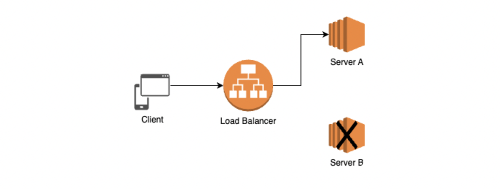

# 2.3.2 애플리케이션 계층을 처리하는 기기

스위치는 여러 장비를 연결하고 데이터 통신을 중재하며 목적지가 연결된 포트로만 전기 신호를 보내 데이터를 전송하는 통신 네트워크 장비이다.

### L7 스위치

서비스의 고가용성(HA; high availability), 고성능을 위한 부하 분산 등의 이유로 서버를 이중화하고, 앞에서 어떤 서버로 요청을 보낼지 라우팅 역할을 하는 `로드 밸런서`를 둔다.

즉 `서버의 부하를 분산하는 기기`를 둠으로써 클라이언트로부터 오는 요청들을 뒤쪽의 여러 서버로 나누어 시스템이 더 많은 트래픽을 처리할 수 있도록 하는 것이다.

URL, 서버, 캐시, 쿠키 등을 기반으로 트래픽을 분산한다.

또한 바이러스, 불필요한 외부 데이터 등을 걸러내는 필터링 기능을 가지고 있으며, 응용 프로그램 수준의 트래픽 모니터링도 가능하다.

### L4 스위치와 L7 스위치의 차이

L4와 L7 스위치는 모두 로드밸런서이다.

- L4 스위치는 전송 계층을 처리하는 기기이다.  
  스트리밍 관련 서비스에서는 사용할 수 없으며, 메시지를 기반으로 인식하지 못하고 IP와 port를 기반으로 트래픽을 분산한다. (NLB; network load balancer 컴포넌트 사용)
- L7 스위치는 애플리케이션 계층을 처리하는 기기이다.  
  IP, port 이외에도 URL, HTTP 헤더, 쿠키 등을 기반으로 트래픽을 분산한다. (ALB; application load balancer 컴포넌트 사용)

### 헬스 체크

L4와 L7 스위치 모두 헬스 체크를 통해 서버가 정상적으로 동작하는지 판별한다.

이때 `헬스체크`는 전송 주기와 재전송 횟수 등을 설정한 이후 반복적으로 서버에 요청을 보내는 것을 말한다.

- `TCP 헬스체크`는 FTP, HTTP, Telnet 등의 도구와 포트 번호를 사용하여 해당 서비스의 제공 가능 유무를 점검한다.
- `Script 헬스체크`는 스크립트에 작성된 순서에 의하여 서버로 메시지를 전송하여, 응답 메시지의 유무에 따라 서비스 가능 유무를 판단한다. 기본적으로는 서버와 TCP 세션을 맺고, request 메시지 전송을 통해 응답 코드를 확인한다.

### 로드밸런서를 이용한 서버 이중화

서비스를 안정적으로 운영하기 위해서는 2대 이상의 서버가 필수적이다.

로드 밸런서는 가상 IP를 통해 여러 서버에 접속하도록 분배할 수 있도록 한다.
