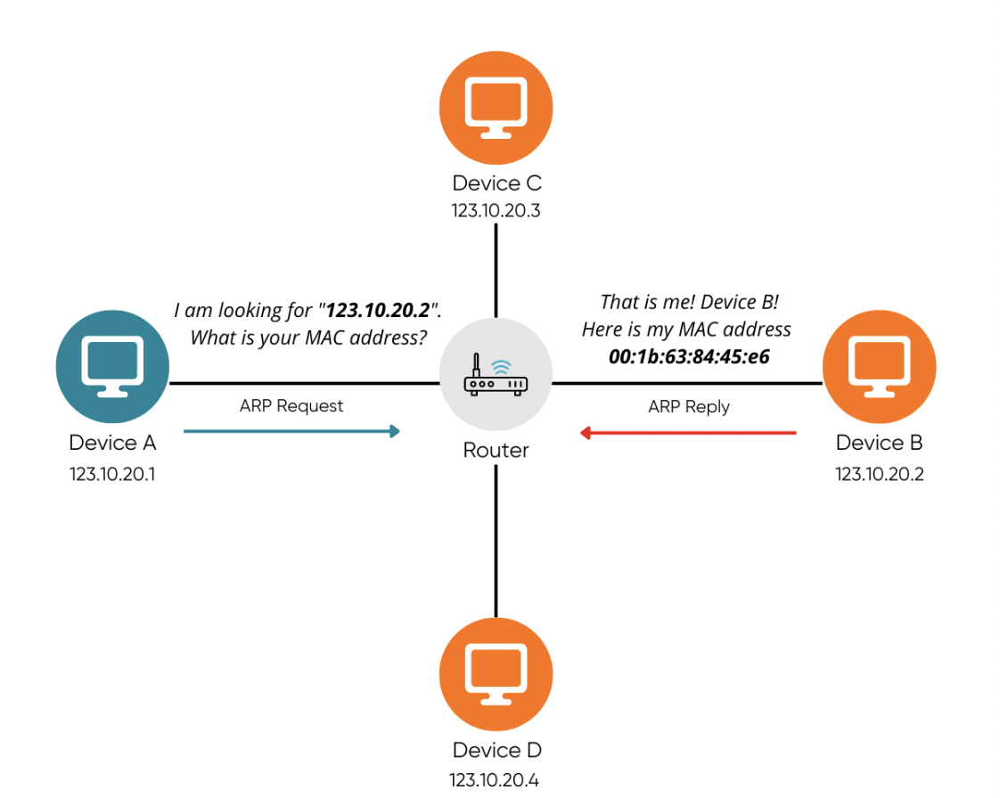

# 2.4.1 ARP (address resolution protocol)

컴퓨터와 컴퓨터 간의 통신은 흔히들 IP 주소 기반으로 통신한다고 알고있다.

하지만 정확히는 IP 주소에서 ARP를 통해 MAC 주소를 찾아, MAC 주소를 기반으로 통신한다.

`ARP(주소 결정 프로토콜)`란, 네트워크 상에서 IP 주소를 물리적 네트워크 주소로 binding 시키기 위해 사용되는 프로토콜이다.

즉, ARP를 통해 가상주소(논리적주소)인 IP를 실제주소(물리적주소)인 MAC으로 변환하는 것이다.

반대로 RARP를 통해 실제 주소인 MAC을 가상주소인 IP로 변환하기도 한다.

> 주환님이 MAC 주소를 설명하실 때 들었던 '배달' 예제을 생각해보면,
> 전화번호(IP, 논리주소)로 손님에게 전화하여 실제 거주중인 주소(MAC, 물리주소)를 알아낸다 ! 고 이해하면 좋을 것 같다.
> ARP는 실제 전화를 받는 손님, 즉 이를 매핑해주는 역할 !

<br />

### ARP의 주소를 찾는 과정



1. 장치 A가 ARP request 브로드캐스트를 보내, IP 주소인 123.10.20.2에 해당하는 MAC 주소를 찾는다. (B, C, D 모든 호스트에게 요청보냄)

2. 해당 주소에 맞는 장치 B가 ARP reply 유니캐스트를 통해 MAC 주소를 반한한다.

```
🥸 브로드캐스트 란 ?
송신 호스트가 전송한 데이터가 네트워크에 연결된 모든 호스트에 전송되는 방식이다.

🥸 유니캐스트 란 ?
고유 주소로 식별된 하나의 네트워크 목적지에 1:1로 데이터를 전송하는 방식이다.
```
