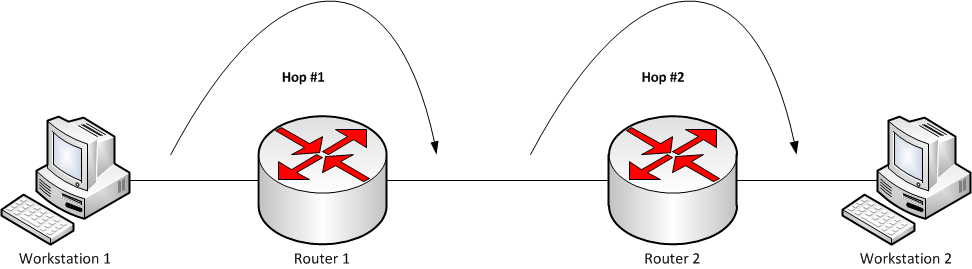

# 2.4.2 홉바이홉 통신

IP 주소를 통해 통신하는 과정을 홉바이홉 통신이라고 한다.

이때 `홉(hop)` 이란 '건너뛰는 모습'을 뜻하는데, 통신망에서 각 패킷이 여러 개의 라우터를 건너가는 모습을 비유적으로 표현한 것이다.



위의 그림처럼 데이터 패킷은 브릿지, 라우터, 게이트웨이를 거치면서 출발지에서 목적지로 경유한다.

패킷이 다음 네트워크 장비로 이동할 때 마다 홉이 하나 발생하는데, `홉 카운트(hop count)` 는 데이터가 출발지와 목적지 사이에서 통과해야 하는 중간 장치들의 개수를 가리킨다.

### 라우팅 테이블 (routing table)

컴퓨터 네트워크에서 목적지 주소를 목적지에 도달하기 위한 네트워크 노선으로 변환시키기 위해 사용된다.

각 라우터의 라우팅 테이블은 모든 목적지 정보에 대해 해당 목적지에 도달하기 위해 거쳐야 할 다음 라우터의 정보를 가지고 있다.

패킷을 받고 라우팅 테이블을 검사하여 다음 라우터를 찾은 뒤, 해당 라우터로 패킷을 넘겨주는 알고리즘을 통해 네트워크 상의 어느곳으로라도 데이터를 전송할 수 있는 것이다.

네트워크 상의 각 라우터에서는 일관된 라우팅 테이블 정보를 가지고 있어야 하며, 그렇지 않을 경우 루프가 발생할 수 있다.

### 게이트웨이 (gateway)

서로 다른 통신망, 프로토콜을 사용하는 네트워크 간 통신을 가능하게 하는 컴퓨터나 소프트웨어를 두루 일컫는 용어이다.

즉, 다른 네트워크로 들어가는 관문 역할을 하는 네트워크 포인트이다.

사용자는 인터넷에 접속하기 위해 수 많은 게이트웨이를 거쳐야 하며, 게이트웨이는 서로 다른 네트워크 상의 통신 프로토콜을 변환해주는 역할을 한다.

게이트웨이는 라우팅 테이블을 통해 확인할 수 있다.

```cmd
kimsoyeon@kimsoyeonui-MacBookAir ~ % netstat -r
Routing tables

Internet:
Destination        Gateway            Flags           Netif Expire
127                localhost          UCS               lo0
localhost          localhost          UH                lo0
```
