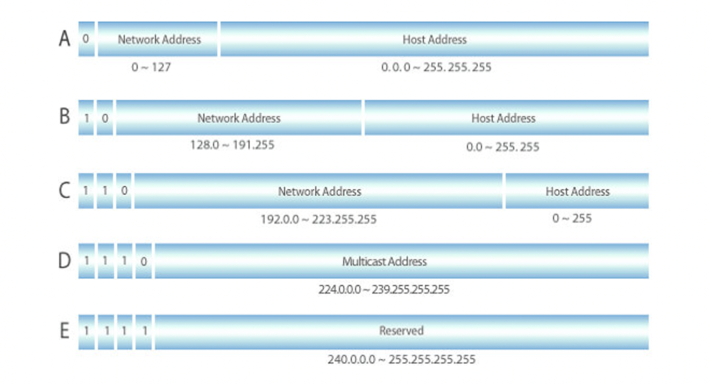
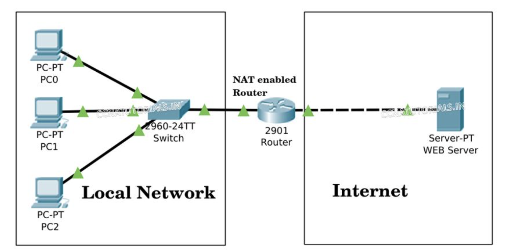

# 2.4.3 IP 주소 체계

IP 주소는 IPv4와 IPv6으로 나뉜다.

IPv4는 32비트를 8비트 단위로 점을 찍어 표기하며, 123.45.67.89 와 같은 방식으로 나타낸다.

IPv6는 64비트를 16비트 단위로 점을 찍어 표기하며, 2001:db8::ff00:42:8329 와 같은 방식으로 나타낸다.

 

IPv4 주소는 전 세계적으로 관리되는 유한한 자원이다(약 43억개). 일부는 특수한 목적으로 예약되었으먀, 주소 규정에 의해 사용이 제한적이기 때문에 IP주소할당 정책에 따라 부여하여 사용하고 있다.

### 클래스 기반 할당 방식 (classful network addressing)

IP주소를 네트워크의 크기나 호스트의 수에 따라 A, B, C, D, E 클래스로 구분한 방식이다.

앞의 부분을 네트워크 주소, 뒤의 부분을 컴퓨터에 부여하는 주소인 호스트 주소(네트워크 상의 개별 호스트 식별용)로 놓아 사용한다.

A, B, C 클래스는 일반 사용자에게 부여하는 네트워크 구성용이고, D 클래스는 멀티캐스트용, E 클래스는 향후 사용을 위해 예약된 주소이다.

각 클래스 별 맨 왼쪽에 있는 비트를 `구분비트`라고 한다. 클래스 A의 경우 맨 왼쪽의 비트는 0이다. 클래스 B는 10이고, 클래스 C는 110 이다. 이를 통해 클래스 간 IP가 나눠진다.

클래스 A에서 가질 수 있는 IP 범위는 00000000.00000000.00000000.00000000 ~ 01111111.11111111.11111111.11111111 이고, 이를 십진수로 표현하면 `0.0.0.0 ~ 127.255.255.255`이다.

다른 네트워크도 이런식의 주소 범위를 가진다고 생각하면, 클래스 B의 범위는 `128.0.0.0 ~ 191.255.255.255` 이고, 클래스 C의 범위는 `192.0.0.0 ~ 223.255.255.255` 이다.

한편 네트워크의 첫번째 주소는 네트워크 주소로 사용되고, 가장 마지막 주소는 브로드캐스트용 주소로 네트워크에 속해있는 모든 컴퓨터에 데이터를 보낼 때 사용된다.

---

클래스 기반 할당 방식은 인터넷 주소 공간을 낭비하는 문제점을 발생시켰는데, 이를 해소하기 위해 DHCP, IPv6, NAT이 출현하였다.

### DHCP (dynamic host configuration protocol)

<b> _| 개념 및 특징_ </b>
IP 및 기타 통신 매개변수를 자동으로 할당하기 위한 네트워크 관리 프로토콜이다.

해당 기술을 통해 네트워크 장치의 IP 주소를 수동으로 설정할 필요 없이 인터넷에 접속할 때마다 자동으로 IP 주소를 할당할 수 있게 되었다.

대부분의 가정용 네트워크에서는 라우터가 IP 주소를 장치에 할당하는 DHCP 서버의 역할을 한다.

<b> _| 장점_ </b>

- 신뢰성 높은 주소 구성 : 동일한 IP 주소를 이용하는 두 명의 사용자 사이의 충돌을 방지하도록 도와준다.
- 높은 이동성 : 사용자는 네트워크 범위 내에서 어디서든지 모바일 장치를 이용할 수 있다.
- 효율적인 네트워크 관리 : 별도의 IP 할당 서버가 필요하지 않아, 네트워크 관리 효율성이 개선된다.
- IP 체계의 유연성 : 최종 사용자에게 지장을 주지 않으면서, IP 주소 체계를 손쉽게 변경할 수 있다.

<b> _| 단점_ </b>

DHCP는 아무런 인증 과정을 거치지 않기 때문에 사이버 공격에 취약하며, 여러가지 보안 문제가 발생할 수 있다.

### NAT (network address translation)

패킷이 라우팅 장치를 통해 전송되는 동안 패킷의 IP 주소 정보를 수정하여 IP 주소를 다른 주소로 매핑하는 방법이다.

IPv4 주소 체계만으로는 많은 주소들을 모두 감당하지 못하는 단점이 있다. 이를 해결하기 위해 NAT로 공인 IP와 사설 IP로 나누어 많은 주소를 처리한다.

즉, 1개의 실제 공인 IP 주소에 다량의 가상 사설 IP 주소를 할당 및 매핑하는 방식이다. (1:1 또는 1:n 주소 변환 방식)

NAT 을 가능하게 하는 소프트웨어는 ICS, RRAS, Netfilter 등이 있다.

사설 네트워크 대역 안에서 PC0, 1, 2는 각각 다른 IP를 가진다. 그리고 NAT 장치를 통해 하나의 공인 IP로 외부 인터넷에 요청할 수 있다.

즉, 하나의 공인 IP를 기반으로 각각 다른 IP를 가지는 것 처럼 인터넷을 사용할 수 있게 된다.

<b> _| 공유기와 NAT_ </b>

NAT를 쓰는 이유는 주로 여러 대의 호스트가 하나의 공인 IP 주소를 사용하여 인터넷에 접속하기 위함이다.

> 인터넷 회선 하나를 개통하고 공유기를 통해 여러 장비(PC, 휴대폰 ... 등)를 연결하여 사용할 수 있다.
> 이것이 가능한 이유는 인터넷 공유기에 NAT 기능이 탑재되어 있기 때문이다.

<b> _| 장점_ </b>

내부 네트워크에서 사용하는 IP주소와 외부에 드러나는 IP 주소를 다르게 유지할 수 있기 때문에 내부 네트워크에 대한 어느정도의 보안 유지가 가능하다.

<b> _| 단점_ </b>

여러 명이 동시에 인터넷을 접속하게 되므로, 실제로 접속하는 호스트 숫자에 따라서 접속 속도가 느려질 수 있다.
