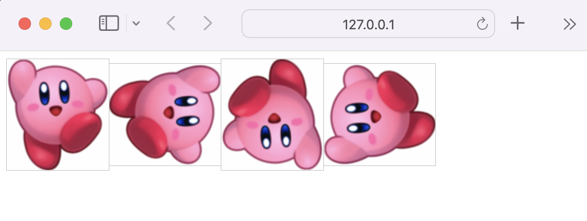

# 2.5.1 HTTP/1.0

### HTTP/0.9은 어땠을까 ?

극히 단순한 원-라인 프로토콜이다.

요청은 단일 라인으로 구성되며, 가능한 메서드는 GET이 유일했다.

```
GET /mypage.html
```

응답또한 극도로 단순했는데, 오로지 파일 내용 자체로 구성되었다.

```html
<html>
  A very simple HTML page.
</html>
```

이후 버전들과는 달리 HTTP 헤더가 없는데, 이는 HTML 파일만 전송될 수 있으며, 다른 유형의 문서는 전송될 수 없음을 의미한다.

상태/오류 코드도 존재하지 않았다. 문제가 발생한 경우, 특정 HTML 파일을 사람이 처리할 수 있도록 해당 파일 내부의 문제에 대한 설명을 함께 되돌려 보내는 것이 전부였다.

---

HTTP/0.9는 매우 제한적이었기 때문에 브라우저와 서버 모두 융통성을 가지도록 빠르게 확장되었다.

### HTTP/1.0 - 확장성 만들기

### | 개요

- 버전 정보가 각 요청에 포함되기 시작했다. (HTTP/1.0이 GET 라인에 붙은 형태)
- 상태 코드 라인 또한 응답의 시작 부분에 붙어 전송되어, 브라우저가 요청에 대한 성공과 실패를 알 수 있고 그 결과에 대한 동작을 할 수 있게 되었다.
- 헤더 개념이 요청과 응답 모두에 도입되어, 메타데이터 전송을 허용하고 프로토콜을 유연하게 확장할 수 있도록 만들어주었다.
- 새로운 HTTP 헤더(`Content-Type`)의 도움으로 평이한 HTML 파일들 외에 다른 문서들을 전송하는 기능이 추가되었다.

다음은 일반적인 요청과 응답이다.

```
GET /mypage.html HTTP/1.0
User-Agent: NCSA_Mosaic/2.0 (Windows 3.1)

200 OK
Date: Tue, 15 Nov 1994 08:12:31 GMT
Server: CERN/3.0 libwww/2.17
Content-Type: text/html
<HTML>
A page with an image
  
</HTML>
```

### | 한계

기본적으로 한 연결 당 하나의 요청을 처리하도록 설계되었다.

서버로부터 파일을 가져올 때마다 TCP의 3-way handshake를 계속해서 열어야하기 때문에 RTT가 증가하는 단점이 있다.

```
🥸 RTT(round trip time)란 ?
패킷이 목적지에 도달하고 나서 다시 출발지로 돌아오기까지 걸리는 시간(패킷 왕복 시간),
즉 네트워크 요청을 시작한 후 응답을 받는데 걸리는 시간을 말한다.

일반적으로 밀리초 단위로 측정하고,
RTT가 낮을 수록 애플리케이션 사용 경험이 향상되고, 애플리케이션의 응답성이 개선된다.

ping 테스트로 측정 가능하다.
```

<br />

<b> _RTT 증가를 해결하기 위한 방법_ </b>

클라이언트와 서버 간 커넥션을 맺을 때 마다 RTT가 증가하니, 서버에 부담이 많이 가고 사용자 응답 시간이 길어졌다.

이를 해결하기 위해 이미지 스플리팅, 코드 압축, 이미지 base64 인코딩을 사용하게 되었다.

<br />

- 이미지 스플리팅 (이미지 스프라이트; image sprite)

여러 개의 이미지를 하나의 이미지로 합쳐서 관리하는 것을 말한다.

웹 페이지에 이미지가 사용될 경우, 해당 이미지를 다운받기 위해 웹브라우저는 서버에 이미지를 요청한다.

한편, 사용된 이미지가 많으면 웹 브라우저는 서버에 해당 이미지의 수 만큼 요청을 보내야하므로 웹 페이지의 로딩 시간이 오래 걸리게 된다.

이미지 스프라이트를 사용하면 이미지를 다운받기 위한 서버 요청을 단 몇번으로 줄일 수 있다.

이를 통해 모바일 환경과 같이 한정된 자원을 사용하는 플랫폼에서는 웹 페이지의 로딩 시간을 단축할 수 있다. 또한 많은 이미지 파일을 관리하는 대신 몇 개의 스프라이트 이미지 파일만을 관리하면 되므로 매우 간편하다.



```html
<body>
  <style>
    .org,
    .r90,
    .r180,
    .r270 {
      background: url("./assets/2.5.1/kirby.png") no-repeat;
      width: 100px;
      height: 109px;
    }

    .org {
      background-position: 0 0;
    }
    .r90 {
      transform: rotate(90deg);
    }
    .r180 {
      transform: rotate(180deg);
    }
    .r270 {
      transform: rotate(270deg);
    }
  </style>
  
  
  
  
</body>
```

<br />

- 코드압축

코드를 압축하여 개행문자, 빈칸을 없애 용량을 최소화하는 방법이다.

자바스크립트 코드 압축 사이트 [바로가기](https://www.toptal.com/developers/javascript-minifier)

```javascript
const express = require("express");
const app = express();
const port = 3000;

app.get("/", (req, res) => {
  res.send("Hello world");
});

app.listen(port, () => {
  console.log(`Example app listening on port ${port}`);
});
```

```javascript
const express = require("express"),
  app = express(),
  port = 3e3;
app.get("/", (p, e) => {
  e.send("Hello world");
}),
  app.listen(3e3, () => {
    console.log("Example app listening on port 3000");
  });
```

<br />

- 이미지 Base64 인코딩

Base64 인코딩은 바이너리 데이터를 ASCII 문자열로 표현하는 방식이다. 즉, 이미지 Base64 인코딩은 이미지 파일을 64진법으로 이루어진 문자열로 인코딩 하는 방법이다.

해당 방법을 사용하면 서버와의 연결을 열고 이미지에 대하여 서버에 HTTP 요청을 할 필요가 없다.

한편, Base64 문자열로 변환할 경우 37% 정도 크기가 더 커진다는 단점이 있다.

```
🥸 인코딩(encoding) 이란 ?
정보의 형태나 형식을 표준화, 보안, 처리 속도 향상, 저장 공간 절약 등을 위해 다른 형태나 형식으로 변환하는 것이다.
```
