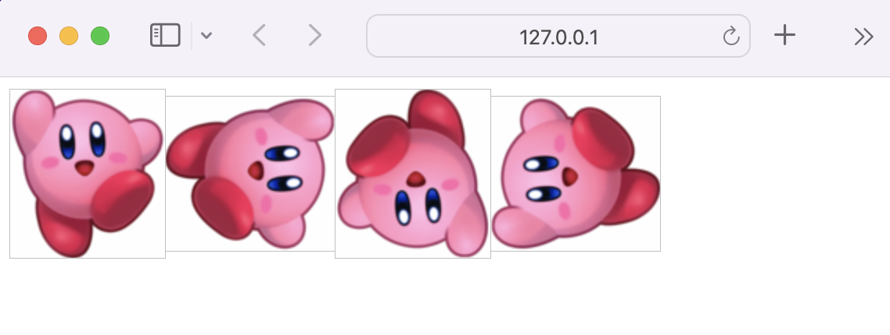

# 2.5.1 HTTP/1.0

기본적으로 한 연결 당 하나의 요청을 처리하도록 설계되었다.

서버로부터 파일을 가져올 때마다 TCP의 3-way handshake를 계속해서 열어야하기 때문에 RTT가 증가하는 단점이 있다.

```
🥸 RTT(round trip time)란 ?
패킷이 목적지에 도달하고 나서 다시 출발지로 돌아오기까지 걸리는 시간(패킷 왕복 시간),
즉 네트워크 요청을 시작한 후 응답을 받는데 걸리는 시간을 말한다.

일반적으로 밀리초 단위로 측정하고,
RTT가 낮을 수록 애플리케이션 사용 경험이 향상되고, 애플리케이션의 응답성이 개선된다.

ping 테스트로 측정 가능하다.
```

### RTT 증가를 해결하기 위한 방법

클라이언트와 서버 간 커넥션을 맺을 때 마다 RTT가 증가하니, 서버에 부담이 많이 가고 사용자 응답 시간이 길어졌다.

이를 해결하기 위해 이미지 스플리팅, 코드 압축, 이미지 base64 인코딩을 사용하게 되었다.

<br />

<b> _| 이미지 스플리팅 (이미지 스프라이트; image sprite)_ </b>

여러 개의 이미지를 하나의 이미지로 합쳐서 관리하는 것을 말한다.

웹 페이지에 이미지가 사용될 경우, 해당 이미지를 다운받기 위해 웹브라우저는 서버에 이미지를 요청한다.

한편, 사용된 이미지가 많으면 웹 브라우저는 서버에 해당 이미지의 수 만큼 요청을 보내야하므로 웹 페이지의 로딩 시간이 오래 걸리게 된다.

이미지 스프라이트를 사용하면 이미지를 다운받기 위한 서버 요청을 단 몇번으로 줄일 수 있다.

이를 통해 모바일 환경과 같이 한정된 자원을 사용하는 플랫폼에서는 웹 페이지의 로딩 시간을 단축할 수 있다. 또한 많은 이미지 파일을 관리하는 대신 몇 개의 스프라이트 이미지 파일만을 관리하면 되므로 매우 간편하다.

다음은 하나의 이미지를 가지고 네 개의 아이콘을 만드는 예제이다.

네개의 아이콘을 만들기 위해 네 개의 이미지를 사용하는 것이 아닌, 이미지 하나만을 가지고 작업한다.



```html
<body>
  <style>
    .org,
    .r90,
    .r180,
    .r270 {
      background: url("./assets/2.5/kirby.png") no-repeat;
      width: 100px;
      height: 109px;
    }

    .org {
      background-position: 0 0;
    }
    .r90 {
      transform: rotate(90deg);
    }
    .r180 {
      transform: rotate(180deg);
    }
    .r270 {
      transform: rotate(270deg);
    }
  </style>
  
  
  
  
</body>
```

<br />

<b> _| 코드압축_ </b>

코드를 압축하여 개행문자, 빈칸을 없애 용량을 최소화하는 방법이다.

자바스크립트 코드 압축 사이트 [바로가기](https://www.toptal.com/developers/javascript-minifier)

```javascript
const express = require("express");
const app = express();
const port = 3000;

app.get("/", (req, res) => {
  res.send("Hello world");
});

app.listen(port, () => {
  console.log(`Example app listening on port ${port}`);
});
```

```javascript
const express = require("express"),
  app = express(),
  port = 3e3;
app.get("/", (p, e) => {
  e.send("Hello world");
}),
  app.listen(3e3, () => {
    console.log("Example app listening on port 3000");
  });
```

<br />

<b> _| 이미지 Base64 인코딩_ </b>

Base64 인코딩은 바이너리 데이터를 ASCII 문자열로 표현하는 방식이다. 즉, 이미지 Base64 인코딩은 이미지 파일을 64진법으로 이루어진 문자열로 인코딩 하는 방법이다.

해당 방법을 사용하면 서버와의 연결을 열고 이미지에 대하여 서버에 HTTP 요청을 할 필요가 없다.

한편, Base64 문자열로 변환할 경우 37% 정도 크기가 더 커진다는 단점이 있다.

```
🥸 인코딩(encoding) 이란 ?
정보의 형태나 형식을 표준화, 보안, 처리 속도 향상, 저장 공간 절약 등을 위해 다른 형태나 형식으로 변환하는 것이다.
```
