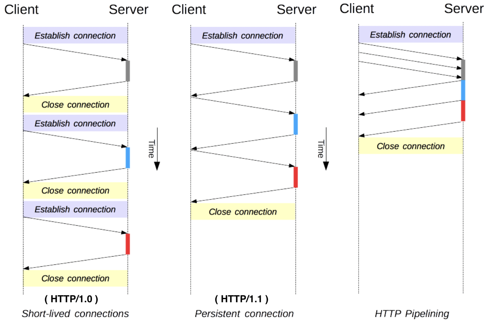
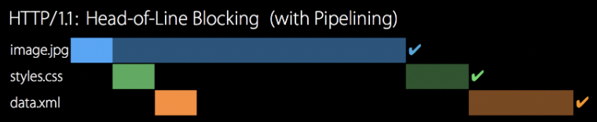

# 2.5.2 HTTP/1.1

### HTTP/1.1 - 표준 프로토콜

### | 개요

- 연속적인 요청 사이에 커넥션을 유지하여, 새 커넥션을 여는데 필요한 시간을 줄였다.

매번 TCP 연결을 시도하지 않고, 한 번 TCP를 초기화 한 이후 `keep-alive` 옵션으로 여러 개의 파일을 송수신 할 수 있도록 변경되었다.



즉, 한번 3-way handshake가 발생하면 그 다음부터 발생하지 않는 것이다.

- 파이프라이닝을 추가하여, 첫번째 요청에 대한 응답이 완전히 전송되기 이전에 두번째 요청을 전송할 수 있도록 하여 네트워크 latency를 낮췄다.
- 추가적인 캐시 제어 메커니즘이 도입되었다.
- 언어/인코딩/타입을 포함한 컨텐츠 협상이 도입되어, 클라이언트와 서버로 하여금 교환하려는 가장 적합한 컨텐츠에 대한 동의를 가능하게 했다.
- `Host` 헤더를 통해 동일 IP 주소에 다른 도메인을 호스트 하여 로드밸런싱을 가능하게 했다.

다음은 하나의 단일 커넥션을 통한 요청과 응답의 전형적인 흐름에 대한 예시이다.

```
GET /ko/docs/Glossary/Simple_header HTTP/1.1
Host: developer.mozilla.org
User-Agent: Mozilla/5.0 (Macintosh; Intel Mac OS X 10.9; rv:50.0) Gecko/20100101 Firefox/50.0
Accept: text/html,application/xhtml+xml,application/xml;q=0.9,*/*;q=0.8
Accept-Language: en-US,en;q=0.5
Accept-Encoding: gzip, deflate, br
Referer: https://developer.mozilla.org/ko/docs/Glossary/Simple_header

200 OK
Connection: Keep-Alive
Content-Encoding: gzip
Content-Type: text/html; charset=utf-8
Date: Wed, 20 Jul 2016 10:55:30 GMT
Etag: "547fa7e369ef56031dd3bff2ace9fc0832eb251a"
Keep-Alive: timeout=5, max=1000
Last-Modified: Tue, 19 Jul 2016 00:59:33 GMT
Server: Apache
Transfer-Encoding: chunked
Vary: Cookie, Accept-Encoding

(content)


GET /static/img/header-background.png HTTP/1.1
Host: developer.mozilla.org
User-Agent: Mozilla/5.0 (Macintosh; Intel Mac OS X 10.9; rv:50.0) Gecko/20100101 Firefox/50.0
Accept: */*
Accept-Language: en-US,en;q=0.5
Accept-Encoding: gzip, deflate, br
Referer: https://developer.mozilla.org/ko/docs/Glossary/Simple_header

200 OK
Age: 9578461
Cache-Control: public, max-age=315360000
Connection: keep-alive
Content-Length: 3077
Content-Type: image/png
Date: Thu, 31 Mar 2016 13:34:46 GMT
Last-Modified: Wed, 21 Oct 2015 18:27:50 GMT
Server: Apache

(image content of 3077 bytes)
```

### | 한계

<b> _HOL(head of line) Blocking_ </b>

기본적으로 HTTP 요청은 순차적이다. 현재의 요청에 대한 응답을 받고 나서야 다음 요청을 실시한다.

한편 HOL이란, 네트워크에서 같은 큐에 있는 요청들이 앞선 요청에 의해 지연될 때 발생되는 성능 저하 현상이다.



> HTTP/1.1에서 파이프라이닝을 하는데도 이와 같은 현상이 발생하는 이유는 무엇일까 ?  
> 첫번째 요청에 대한 응답이 오기도 전에 또 다른 요청을 연속적으로 보낸다고는 했지만, 어쨌든 응답은 순차적으로 온다.  
> 따라서 첫번째 요청에 대한 응답이 오래걸리면 두번째 요청에 대한 응답은 첫번째 요청에 대한 응답이 온 후 도착할 수 있으므로 지연이 발생하게 되는 것이다.

<b> _무거운 헤더 구조_ </b>

쿠키 등 많은 메타데이터가 들어있고, 압축 되지 않아 무겁다.
