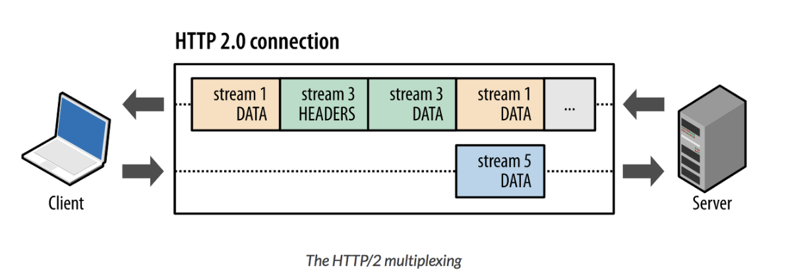

# 2.5.3 HTTP/2

### HTTP/2 - 더 나은 성능을 위한 프로토콜

HTTP/2는 성능 개선에 집중한 프로토콜이다. 최근 웹을 베이스로 하여 데이터를 전송하는 트래픽이 기하급수적으로 증가했기 때문이다.

HTTP/2는 HTTP/1.x보다 지연시간을 줄이고 응답 시간을 더 빠르게 할 수 있으며, 멀티플랙싱, 헤더 압축, 서버 푸시, 요청의 우선순위 처리를 지원하는 프로토콜이다.

### | 바이너리 메시지 프레임 (binary message framing)

HTTP/2는 HTTP/1.1과는 다르게 메시지를 텍스트 포맷이 아닌 바이너리 포맷으로 인코딩한다.

이렇게 데이터의 포맷이 변경되었기 때문에 당연히 클라이언트와 서버가 포맷을 변경하는 코드를 구현해야 하지만, 클라이언트는 브라우저에서 이미 처리하기 때문에 신경쓰지 않아도 되고 서버는 프레임워크가 이미 구현했기 때문에 신경쓰지 않아도 된다.

### | 멀티플렉싱

<b> _출현 배경_ </b>


이전 모델인 HTTP/1.x에서는 하나의 요청 당 한개의 응답만을 받을 수 있었기 때문에 다중 병렬 요청 시, 여러 개의 TCP 연결을 사용해야만 했다.

이러한 통신은 HOL 이슈를 야기했다. 즉, 앞서 보낸 패킷의 처리가 지연됨에 따라 뒤에 전달되어야할 패킷들에 대한 처리가 지연되는 현상이 발생한 것이다.

<b> _개념_ </b>

하나의 TCP 연결에 여러 리소스를 쪼개어 요청하고, 응답도 나누어 받을 수 있다.

바이너리 메지시 프레임을 사용하며 메시지를 프레임 단위로 나누는 것이 가능해졌다. 이를 통해 여러 리소스를 요청한 뒤, 메시지를 나눈 프레임이 모여 하나의 메시지를 만들 수 있게 되면 바로 사용할 수 있게 되었다.



위의 그림은 하나의 연결 내 여러 스트림을 캡쳐한 것이다.

병렬적인 스트림들을 통해 데이터를 서빙하며, 스트림 내의 데이터들도 쪼개져 있는 것을 볼 수 있다.

애플리케이션에서 받아온 메시지를 독립된 프레임으로 조각내어 서로 송수신한 이후, 다시 조립하여 데이터를 주고 받는 것이다.


이를 통해 단일 연결을 사용하여 병렬로 여러 요청을 받고, 응답을 줄 수 있게 되었다.

### | 헤더 압축

<b> _출현 배경_ </b>

HTTP/1.x에서는 메타데이터를 항상 일반 텍스트로 전송했으며, 이는 500 ~ 800byte의 오버헤드를 발생시켰다.

나아가 HTTP 쿠키를 사용하는 경우 킬로바이트를 더 추가하기도 했다.

웹이 복잡해질 수록 서버에 요청하는 건수가 늘어나기 때문에, 이렇게 큰 헤더는 부담이 될 수 밖에 없다.

<b> _개념_ </b>

HTTP/2에서는 헤더 압축을 통해 해결했는데, 허프만 코딩 압축 알고리즘을 사용하는 HPACK 형식을 따른다.

```
🥸 허프만 코딩 (huffman coding) 이란 ?
문자열을 문자 단위로 쪼개 빈도수를 세어 빈도가 높은 정보는 적은 비트수를 사용하여 표현하고,
빈도가 낮은 정보는 비트 수를 많이 사용하여 표현해서
전체 데이터의 표현에 필요한 비트양을 줄이는 원리이다.
```

### | 서버 푸시

<b> _출현 배경_ </b>

HTTP/1.x에서는 클라이언트가 서버에 요청을 해야 파일을 다운로드 받을 수 있었다. 즉, 서버가 클라이언트의 요청이 없는 리소스를 전송할 수 없었다.

> 서버는 클라이언트가 이후에 어떤 리소스를 요청할지 알고있음에도 불구하고  
> 클라이언트의 다음 요청까지 기다려야 하므로 효율성이 바닥...

<b> _개념_ </b>

클라이언트의 요청 없이 서버가 바로 리소스를 푸시할 수 있는 기능이다. 다시말해 클라이언트의 요청이 한개임에도 불구하고, 여러 개의 응답을 보낼 수 있는 서버의 기능을 뜻한다.

> 이친구 지금 main.html을 불렀으니까 이제 js 랑 css 달라고 하겠네 ~~ 를 서버가 미리 알고 필요한 파일들을 클라이언트측에 푸시해놔서 불필요한 통신을 없애는 것이다.
