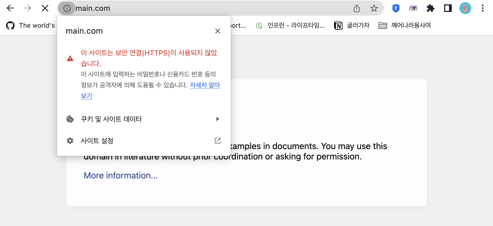
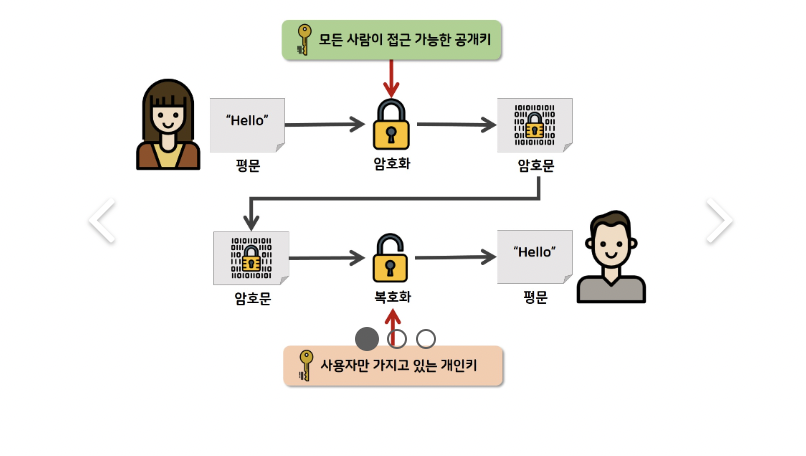
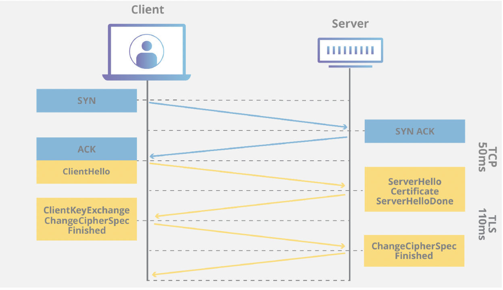

# 2.5.4 HTTPS (hypertext transfer protocol secure)

### | HTTPS 란 ?

HTTPS는 웹브라우저와 웹 사이트 간에 데이터를 전송하는데 사용되는 기본 프로토콜인 HTTP의 보안 버전이다.

HTTPS는 데이터 전송의 보안을 강화하기 위해 암호화된다.

이것은 사용자가 은행계좌, 이메일 서비스, 건강보험 제공자에 로그인하는 것 과 같이 민감한 데이터를 전송할 때 특히 중요하다.

모든 웹사이트, 특히 로그인 자격 증명이 필요한 웹사이트는 HTTPS를 사용해야 한다.



### | HTTPS의 동작방식

암호화 프로토콜을 사용하여 통신을 암호화 한다. 이 프로토콜은 이전에는 `SSL`로 알려져 있었지만, `TLS`라고도 한다.

이 프로토콜은 비대칭 공개 키를 사용하여 통신을 보호하는데, 해당 유형의 보안 시스템은 두 당사자 간의 통신을 암호화 하기 위해 두 개의 서로 다른 키를 사용한다.



<b> _개인키_ </b>

이 키는 웹사이트 소유자가 제어하며, 비공개로 유지된다.

즉 웹서버에 있으며 공개키로 암호화된 정보를 해독하는데 사용된다.

<b> _공개키_ </b>

이 키는 안전한 방식으로 서버와 상호작용하려는 모든 사람이 사용할 수 있다.

공개키로만 암호화된 정보는 개인키로 해독할 수 있다.

### | HTTPS의 중요성

트래픽을 암호화하여 패킷이 스니핑되거나, 다른 방식으로 가로채더라도 무의미한 문자로 인식되도록 하여 보안과 신뢰성을 유지하기 위해 필요하다.

### | HTTP와의 차이

80번 포트를 사용하는 HTTP와는 달리, HTTPS는 443번 포트를 사용한다.

이 외에 기술적으로 보았을 때, 별개의 프로토콜이라고 할 수 없다.

HTTPS는 HTTP 프로토콜을 통해 TLS/SSL 암호화를 한 것 뿐이다.

---

### | SSL(secure socket layer) 이란 ?

<b> _개요_ </b>

일반적으로 TLS라고 불리는 SSL은 인터넷 트래픽을 암호화하고, 서버 신원을 확인하기 위한 프로토콜이다.

웹 사이트가 HTTP에서 보다 안전한 HTTPS로 이동할 수 있게 해주는 것이다.

이러한 SSL은 종종 디지털 인증서라고도 불리며, 브라우저와 서버 사이의 암호화된 연결을 수립하는데 사용한다.

SSL 인증서는 웹 사이트의 원본 서버에서 호스팅되는 데이터 파일로, 다음과 같은 내용을 포함한다.

- 인증서가 발급된 대상 도메인 이름
- 발급받은 사람, 조직, 장치
- 발급한 인증 기관
- 인증 기관의 디지털 서명
- 관련 하위 도메인
- 인증서 발급 날짜
- 인증서 만료 날짜
- 공개키(개인키는 비밀로 유지됨)

<br />

<b> _웹 사이트에서 SSL 인증서가 필요한 이유_ </b>

사용자 데이터를 안전하게 유지하고, 웹 사이트의 소유권을 확인하며, 공격자가 사이트의 가짜 버전을 만드는 것을 방지하여 `사용자의 신뢰를 얻기 위함` 이다.

- `암호화` 관점 : SSL 인증서가 지원하는 공개-개인키 페어링을 통해 SSL/TLS 암호화가 가능하다. 클라이언트는 서버의 SSL 인증서에서 TLS 연결을 여는데 필요한 공개키를 받는다.
- `인증` 관점 : SSL 인증서는 클라이언트가 실제로 도메인을 소유하고 있는 올바른 서버와 통신하고 있는지 확인한다. 이를 통해 스푸핑등의 공격을 방지할 수 있다.
- `HTTPS` 관점 : 전송 중인 사용자의 데이터를 보호하고, 사용자 관점에서 사이트를 더욱 신뢰할 수 있게 한다.

```
🥸 스푸핑(spoofing) 이란 ?
승인받은 사용자인것처럼 시스템에 접근하거나, 네트워크상에서 허가된 주소로 가장하여 접근 제어를 우회하는 공격 행위이다.
```

<br />

<b> _웹 사이트에서 SSL 인증서를 받는 방법_ </b>

인증 메커니즘은 CA(Certificate Authorities)에서 발급한 인증서를 기반으로 이루어진다.

CA에서 발급한 인증서는 안전한 연결을 시작하는데 있어 필요한 `공개키`를 클라이언트에 제공하고, 사용자가 접속한 서버가 `신뢰할 수 있는 서버`임을 보장한다.

인증서는 서비스정보, 공개키, 지문, 디지털서명 등으로 이루어져 있다.

만약 자신의 서비스에 대한 CA 인증서를 발급받고 싶다면, 사이트 정보와 공개키를 CA에 제출해야 한다. 이후 CA는 비밀키 등을 기반으로 인증서를 발급해줄 것이다.

### | TLS(전송계층보안; transport layer security) 란 ?

HTTPS에서 클라이언트와 서버간 통신 전 SSL 인증서로 신뢰성 여부를 판단하기 위해 연결하는 방식이다.

이는 전송계층에서 보안을 제공하는 프로토콜로, SSL의 향상된-더욱 안전한 버전이다.

### | TLS/SSL

즉, 클라이언트와 서버가 통신할 때 SSL/TLS를 통해 제3자가 메시지를 도청하거나 변조하지 못하도록 한다.

SSL/TLS는 보안 세션을 기반으로 데이터를 암호화하며, 보안 세션이 만들어질 때 인증 메커니즘/키 교환 암호화 알고리즘/해싱 알고리즘이 사용된다.

<b> _보안세션 이란 ?_ </b>

보안이 시작되고 끝나는 동안 유지되는 세션을 가리킨다.

SSL/TLS 은 핸드셰이크를 통해 보안 세션을 생성하고 이를 기반으로 상태 정보를 공유한다.

<b> _TLS handshake_ </b>

사용자가 웹페이지에 연결하면 웹페이지는 보안 세션을 시작하는데 필요한 공개키가 포함된 SSL 인증서를 전송한다. 두 대의 컴퓨터인 클라이언트와 서버는 보안 연결을 설정하는데 사용되는 전후 통신인 SSL/TLS 핸드셰이크라는 프로세스를 거친다.



TLS 핸드셰이크는 TCP 핸드셰이크를 통해 TCP 연결이 열린 후에 발생한다.

그 과정 중 클라이언트와 서버는 다음을 수행한다.

1. `"client hello" 메시지` : 클라이언트는 서버에 "hello" 메시지를 보냄으로써 핸드셰이크를 시작한다. 해당 메시지에는 클라이언트가 지원하는 TLS 버전, 지원되는 암호화 제품군 등이 포함된다.

2. `"server hello" 메시지` : 클라이언트 hello 메시지에 대한 응답으로 서버는 서버의 SSL 인증서, 서버가 선택한 암호화 제품군 등을 포함하는 메시지를 보낸다.

3. `인증` : 클라이언트는 서버의 SSL 인증서를 발급한 인증 기관에서 '서버가 누구인지'를 확인하고, 클라이언트가 도메인의 실제 소유자와 상호작용하고있음을 확인한다.

4. `프리마스터 시크릿` : 클라이언트는 임의의 바이트 문자열인 "프리마스터 시크릿"을 하나 더 보낸다. premaster secret은 공개키로 암호화되며, 서버에서 개인키로 복호화 할 수 있다.
   (이때 클라이언트는 서버의 SSL 인증서에서 공개키를 얻음)

5. `사용된 개인키` : 서버가 premaster secret을 해독한다.

6. `생성된 세션키` : 클라이언트와 서버 모두 클라이언트임의 / 서버임의 / 프리마스터시크릿 에서 세션키를 생성한다. 이때 모두가 동일한 결과에 도달해야 한다.

7. `클라이언트가 준비됨` : 클라이언트가 세션 키로 암호화된 "완료" 메시지를 보낸다.

8. `서버 준비됨` : 서버가 세션키로 암호화된 "완료" 메시지를 보낸다.

9. `보안 대칭 암호화 달성` : 핸드셰이크가 완료되고 세션키를 사용하여 통신이 계속된다.

한편, 디피-헬만 핸드셰이크는 개인키를 사용하지 않고 세션키를 생성한다.

4.번에서와 같이 클라이언트가 프리마스터 시크릿을 생성하여 서버로 보내지 않고, 클라이언트와 서버는 교환한 DH 매개변수를 사용하여 일치하는 프리마스터 시크릿을 개별적으로 계산하는 것이다.
