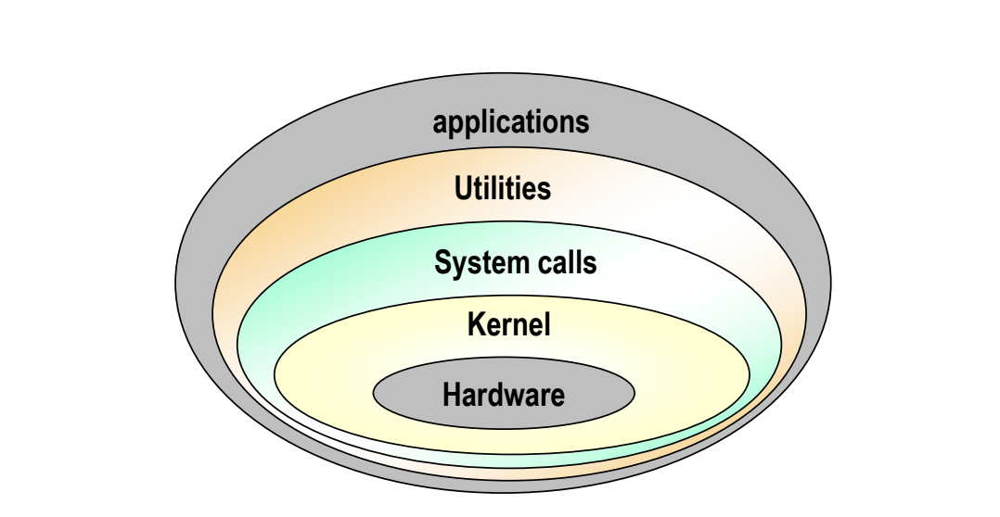
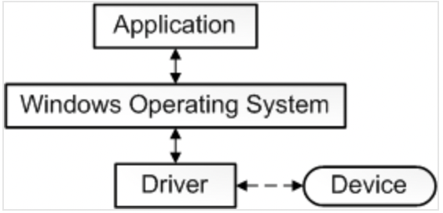
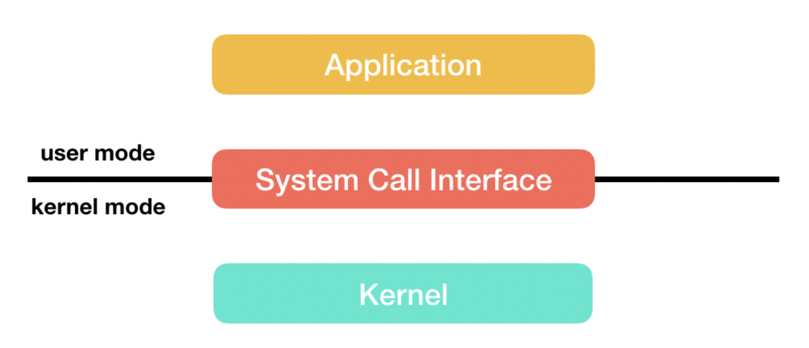
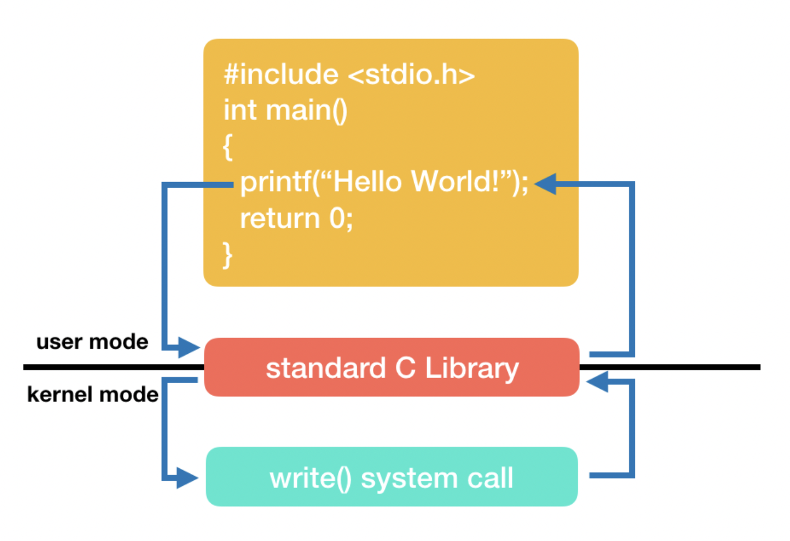

# 3.1.1 운영체제의 역할과 구조

### | 운영체제의 역할

1. CPU 스케쥴링 및 프로세스 관리 : CPU 소유권을 어떤 프로세스에 할당할지, 프로세스의 생성과 삭제, 자원 할당 및 반환을 관리한다.

2. 메모리 관리 : 한정된 메모리를 어떤 프로세스에 얼만큼 할당해야 하는지 관리한다.

3. 디스크 관리 : 디스크파일을 어떠한 방법으로 보관할지 관리한다.

4. I/O 디바이스 관리 : I/O 디바이스들인 마우스, 키보드와 컴퓨터간에 데이터를 주고받는 것을 관리한다.

> 이후에도 나오겠지만, 프로세스는 컴퓨터에서 연속적으로 실행되고 있는 프로그램을 말합니다.  
> 이때 프로그램은 일반적으로 하드디스크 등에 저장되어 있는 실행코드이고, 프로세스는 프로그램을 구동하여 프로그램과 그 상태가 메모리 상에서 실행되는 작업 단위를 지칭합니다.
> 예를 들어 인텔리제이(프로그램)를 여러 번 구동하면 여러 개의 프로세스가 메모리에 실행되는 것이죠 !

### | 운영체제의 구조



유저 프로그램인 애플리케이션이 최상단에 있고, 하드웨어가 최하단에 있다.

이때 유틸리티인 GUI / CLI, 시스템콜, 커널, 드라이버 부분이 운영체제를 지칭한다.

<b> _드라이버_ </b>

하드웨어를 제어하기 위한 소프트웨어로, 운영체제와 디바이스가 서로 통신할 수 있도록 한다.

애플리케이션이 디바이스에서 일부 데이터를 읽어야 한다고 가정했을 때의 통신을 단순화하면 다음과 같다.



1. 애플리케이션은 운영체제에서 구현된 함수를 호출한다.
2. 운영체제는 드라이버에서 구현한 함수를 호출한다.
3. 디바이스는 하드웨어와 통신하여 데이터를 가져온다.
4. 가져온 데이터를 운영체제에 반환하여 애플리케이션에 반환한다.

<b> _커널_ </b>

운영 체제의 핵심 부분이자 시스템콜 인터페이스를 제공하여 보안, 메모리, 프로세스, 파일시스템, I/O 디바이스, I/O 요청관리 등의 중추적인 역할을 한다.

<b> _시스템콜_ </b>

OS는 다양한 서비스들을 수행하기 위해 하드웨어를 직접 관리하지만, 애플리케이션단에서는 OS가 제공하는 인터페이스를 통해서만 자원을 사용할 수 있다. 이때 OS가 제공하는 이러한 인터페이스를 시스템콜이라고 한다.

시스템콜을 직접 사용하는데는 어려움이 있기 때문에 프로그래밍 언어들은 유저가 시스템콜을 편리하게 사용하기 위한 수단으로써 API를 제공한다.



다음은 C 언어를 사용하여 Hello world를 출력하는 과정이다.

```c++
#include <cstdio>

int main() {
    // ...
    printf("hello world");
    // ...
    return 0;
}
```

1. 유저가 실행한 printf() 함수는 `user mode`에서 실행되어 cstdio 라이브러리를 호출한다.
2. 해당 라이브러리는 시스템콜인 wirte() 함수를 호출하고, 실행의 흐름은 `kernel mode`로 전환된다. (modebit 1 &rarr; 0)
3. 커널은 호출을 실행하여, 모니터에 문자열을 출력하고 실행의 흐름은 다시 `user mode`로 돌아와 printf() 함수의 다음 단계를 진행한다. (modebit 0 &rarr; 1)



이러한 과정을 통해 컴퓨터 자원에 대한 직접적인 접근을 차단할 수 있고, 프로그램을 다른 프로그램으로부터 보호할 수 있다.

또한 프로세스나 스레드에서 운영체제로 어떠한 요청을 할 때도 시스템콜과 커널을 거쳐 운영체제에 전달된다.

```
🥸 modebit 이란 ?
0 또는 1을 가지는 플래그변수로, 시스템 콜이 작동될 때 모드비트를 참고하여 유저모드와 커널모드를 구분한다.
이때 0은 커널모드, 1은 유저모드이다.
```

<b> _GUI_ </b>

사용자가 전자장치와 상호작용할 수 있도록 하는 사용자 인터페이스의 한 형태이다.
커맨드 창이 아닌, 아이콘을 마우스로 클릭하는 동작으로 컴퓨터와 상호작용할 수 있도록 해준다.
