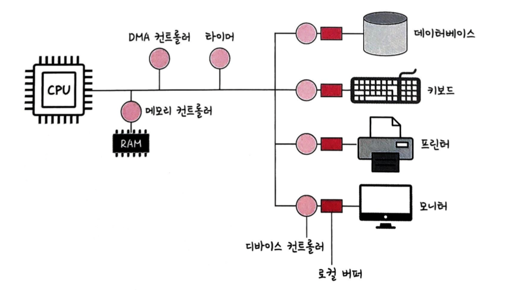

# 3.1.2 컴퓨터의 요소

컴퓨터의 구성요소는 연산을 담당하는 CPU, 기억을 담당하는 Memory, 입출력 장치(I/O) 3가지로 나뉜다.

조금 더 자세히 살펴보면 아래 그림과 같다.

### | CPU(central processing unit)

산술논리연산장치, 제어장치, 레지스터로 구성되어 있는 컴퓨터 장치를 말한다.

또한 인터럽트를 통해 단순히 메모리에 존재하는 명령어를 해석하여 실행한다.

 즉, 관리자 역할을 하는 운영체제의 커널이 프로그램을 메모리에 올려 프로세스를 만들면, CPU가 이를 처리하는 것이다. 

- `산술논리 연산장치(ALU; arithmetic logic unit)` : 덧셈, 뺄셈 같은 두 숫자의 산술연산과 배타적 논리합, 논리곱과 같은 논리 연산을 계산하는 디지털 회로이다.
- `제어창치(CU; control unit)` : 프로세스 조작을 지시하는 CPU의 한 부품이다. 입출력장치 간의 통신을 제어하고, 명령어들을 읽고 해석하며 데이터 처리를 위한 순서를 결정한다.
- `레지스터(register)` : CPU 안에 존재하는 매우 빠른 임시기억장치를 가리킨다. CPU와 직접 연결되어 있으므로 연산 속도가 메모리보다 수십~수백배 빠르다. CPU는 자체적으로 데이터를 저장할 방법이 없기 때문에 레지스터를 거쳐 데이터를 전달한다.

<b> _인터럽트(interrupt) 란 ?_ </b>

컴퓨터에서 발생한 이벤트를 CPU에 보내는 신호이다.

이러한 인터럽트가 발생하면 CPU는 하던 작업을 멈추고 즉시 해당 인터럽트를 처리해야 한다. 예컨대 키보드, 마우스 등의 I/O 디바이스로 인한 인터럽트 / 0으로 숫자를 나누는 산술 연산에서의 인터럽트 / 프로세스 오류 등으로 발생할 수 있다.

인터럽트의 종류는 다음과 같다.

- 하드웨어 인터럽트 : 키보드 및 마우스 연결 등 I/O 디바이스에서 발생하는 인터럽트를 의미하며, 물리적 신호를 CPU로 직접 전송한다.
- 소프트웨어 인터럽트 : 트랩(trap) 이라고도 하며, 프로세스 오류 등으로 인해 발생한다. 이때는 시스템 콜을 통해 수행된다.

### | Memory

전자회로에서 데이터나 상태, 명령어등을 기록하는 장치를 말하며, 보통 RAM(random access memory)을 가리킨다.

 즉, CPU 는 계산을 담당하고 메모리는 기억을 담당한다. 

> CPU : 노예 수 일을 해라 일 !  
> 메모리 : 노예가 준비한 리어카. 리어카가 클수록 한번에 더 많은 옥수수를 담을 수 있다. 즉, 게임하면서 유튜브 볼 수 있게 해주는 애. 메모리가 크면 많은 일을 동시에 할 수 있다.  
> 램이 작으면 CPU가 좋더라도 속도가 느림

---

그외...

<b> _| DMA 컨트롤러_ </b>

I/O 디바이스가 메모리에 직접 접근할 수 있도록 하는 하드웨어 장치이다.

CPU에 너무 많은 인터럽트 요청이 들어오는 것을 막기 위해 CPU의 부하를 분산하면서, 하나의 작업을 DMA 컨트롤러와 CPU가 동시에 처리하는 것을 방지한다.

<b> _| 타이머_ </b>

특정 프로그램에 시간 제한을 두어, 시간이 많이 걸리는 프로그램이 작동할 때 제한을 걸기 위함이다.

<b> _| 디바이스 컨트롤러_ </b>

컴퓨터에 연결되어 있는 각 I/O 디바이스들을 관리하는 작은 CPU를 말한다.

디바이스 컨트롤러는 작업 공간이 필요하기 때문에, 로컬 버퍼라는 메모리 공간을 두어 각 디바이스에서 데이터를 임시로 저장하도록 한다.

> CPU에서 모든 입출력을 직접 처리하려면 성능이 굉장히 떨어질 것...  
> 그래서 각 디바이스별로 작은 CPU를 두고, 여기서 보낸 인터럽션을 CPU가 차례로 처리하는 것임
