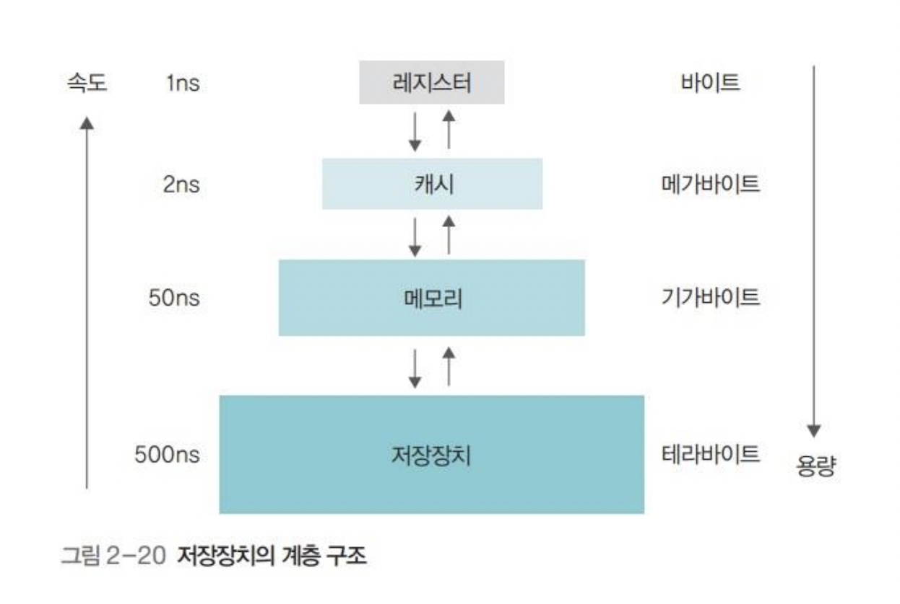

# 3.2.1 메모리 계층

- 레지스터 : CPU 안에 있는 작은 메모리, 휘발성/속도 가장 빠름/기억용량 가장 적음
- 캐시 : L1, L2 캐시를 지칭, 휘발성/속도빠름/기억용량 적음
- 주기억장치 : RAM을 지칭, 휘발성/속도보통/기억용량 보통
- 보조기억장치: HDD, SSD를 지칭, 비휘발성/속도낮음/기억용량 많음

### | RAM

램은 하드디스크로부터 일정량의 데이터를 복사해 임시 저장하고, 이를 필요시마다 CPU에 빠르게 전달하는 역할을 한다.

'로딩중' 페이지가 뜨는 이유는 하드디스크 또는 인터넷에서 데이터를 읽어 RAM으로 전송하는 과정이 아직 끝나지 않았음을 의미한다.

### | 캐시(cache)

데이터를 미리 복사해 놓는 임시 저장소이자, 빠른 장치와 느린 장치 간의 속도 차이로 인해 발생하는 병목 현상을 줄이기 위한 메모리이다.

캐시 접근 시간에 비해 원래 데이터를 접근하는 시간이 오래걸리는 경우 혹은 값을 다시 계산하는 시간을 절약하고 싶은 경우 사용한다.

<b> _지역성_ </b>

캐시가 효율적으로 동작하려면, 캐시에 저장할 데이터가 지역성을 가져야한다.

이때 `지역성`이란 데이터 접근이 시간적,공간적으로 가깝게 일어나는 것을 의미한다.

- `시간적 지역성` : 최근 사용한 데이터에 다시 접근하려는 특성을 의미한다.
- `공간적 지역성` : 특정 데이터와 가까운 주소가 순서대로 접근되었을 경우를 의미한다.

<b> _캐시히트, 캐시미스_ </b>

- `캐시히트` : CPU가 원하는 데이터가 캐시에 있는 상태, 해당 데이터를 제어장치를 거쳐 가져온다. 위치가 가깝고 CPU 내부 버스를 기반으로 자동하기 때문에 빠르다.
- `캐시미스` : CPU가 원하는 데이터가 캐시에 없는 상태, RAM으로부터 가져오게 되는데, 이는 시스템 버스를 기반으로 작동하기 때문에 느리다.

### | 웹브라우저 캐시

CPU 캐시는 하드웨어를 통해 관리되고, 그 밖의 다른 캐시들은 대개 소프트웨어적으로 관리된다.

대표적으로 쿠키, 로컬 스토리지, 세션 스토리지가 있다. 이들은 보통 사용자의 커스텀한 정보나 인증모듈 관련 사항들을 웹 브라우저에 저장하여 추후 서버에 요청 시 사용한다.

<b> _쿠키(cookie)_ </b>

만료기한이 있는 키-값 저장소로, 세션관리/개인화(사용자 선호 테마 등 세팅)/트래킹 등의 목적을 위해 사용된다.

SameSite 옵션을 strict로 설정하지 않았을 경우 다른 도메인에서 요청 시, 자동 전송된다. 4KB까지 데이터를 저장할 수 있고 만료기한을 정할 수 있다.

쿠키를 설정할 때는 `document.cookie`로 쿠키를 볼 수 없도록 `HttpOnly` 옵션을 거는 것이 중요하다. (그렇지 않으면 자바스크립트로 접근 가능함)

클라이언트 또는 서버에서 만료기한 등을 정할 수 있지만, 보통 서버에서 만료기한을 정한다.

<b> _로컬 스토리지(local storage)_ </b>

만료기한이 없는 키-값 저장소이다. 10MB까지 저장할 수 있으며 웹 브라우저를 닫아도 유지되고 도메인 단위로 저장, 생성된다.

HTML5를 지원하지 않는 웹 브라우저에서는 사용할 수 없으며, 클라이언트에서만 수정 가능하다.

<b> _세션 스토리지_ </b>

만료기한이 없는 키-값 저장소이다. 5MB까지 저장할 수 있으며 탭 단위로 세션 스토리지를 생성하며, 탭을 닫을 때 해당 데이터가 삭제된다.

HTML5를 지원하지 않는 웹 브라우저에서는 사용할 수 없고, 클라이언트에서만 수정 가능하다.

### | 데이터베이스 캐시

데이터베이스 시스템을 구축하는 경우, 메인 데이터베이스 위에 레디스(redis) 를 캐싱 계층으로 두어 성능을 향상시킨다.
