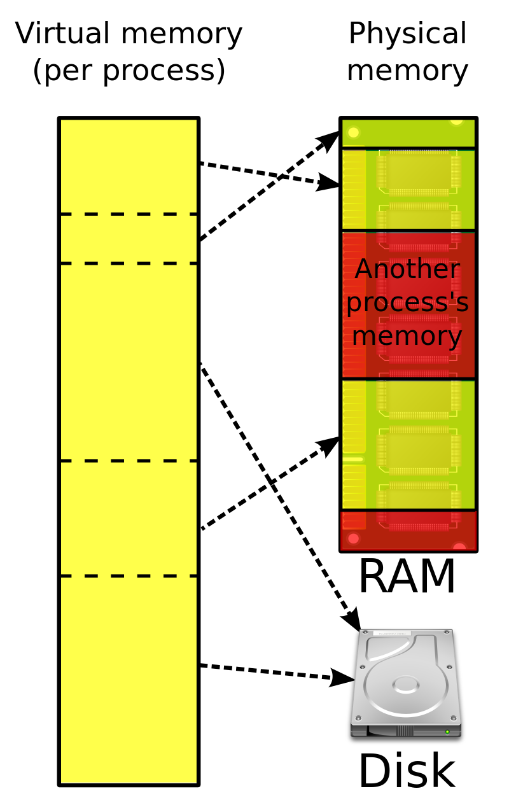

# 3.2.2 메모리 관리

운영체제의 대표적인 할 일은 메모리 관리이다.

가상 메모리는 대표적인 관리 기법이다.

### | 가상 메모리 (virtual memory)

컴퓨터가 실제로 이용 가능한 메모리 자원을 추상화하여 이를 사용하는 사용자들에게 매우 큰 메모리로 보이게 만드는 것을 가리킨다.

각 프로그램에 실제 메모리 주소가 아닌 가상의 메모리 주소를 준다.



가상주소(logical address)는 `메모리 관리 장치(MMU)`에 의해 실제주소(physical address)로 변환된다.

> 왜 쓸까 ?  
> 메인 메모리의 크기는 한정되어 있으므로 물리적인 메모리 크기보다 큰 프로세스를 실행시킬 수 없다.  
> 이러한 문제를 해결하기 위해 불필요한 함수나 배열은 등은 제외하고, 필요한 부분만 메모리에 적재하여 실제로 메모리에 올라가는 프로세스의 크기를 최소화 시킨다.

<br />

### | 페이지 폴트(page fault)

> 만약 프로세스 주소 공간에는 존재하지만 해당 컴퓨터의 RAM에는 없는 데이터 접근하면 어떻게 될까 ?

1. CPU가 트랩을 발생시켜 운영체제에 알린다.
2. 운영체제는 CPU의 동작을 잠시 멈춘다.
3. 운영체제는 페이지 테이블을 확인한다.  
   (가상메모리에서 페이지 존재확인 &rarr; 없으면 물리메모리에서 프레임 확인 &rarr; 없으면 `스와핑` 발동)
4. 비어있는 프레임에 해당 페이지를 로드하고, 페이지 테이블을 최신화 한다.
5. 중단되었던 CPU를 다시 시작한다.

```
🥸 페이지(page) 란 ?
가상 메모리를 사용하는 최소 크기 단위

🥸 프레임(frame) 이란 ?
실제 메모리를 사용하는 최소 크기 단위
```

### | 스와핑(swapping)

메모리에서 당장 사용하지 않는 영역을 하드디스크로 옮기고, 하드디스크의 일부분을 마치 메모리 처럼 불러와 쓰는 것이다.

이를 통해 페이지 폴트가 일어나지 않는 것처럼 만든다.

### | 스레싱(thrashing)

> 메모리에 너무 많은 프로세스가 동시에 올라가면 스와핑이 많이 일어나게 된다.  
> 스와핑이 많이 일어나면 안좋은 점은 없을까 ?

스레싱이란 메모리의 페이지 폴트율이 높은 것, 즉 실행시간보다 페이지를 찾는데 시간과 자원이 소비되는 현상이다.

페이지 폴트가 일어나면 CPU 이용률이 낮아지는데, 이때 운영체제는 CPU가 처리하는 프로세스가 적다고 생각하고 가용성을 높이기 위해 더 많은 프로세스를 올린다.

이러한 악순환이 반복되어 스레싱이 발생하게 된다.

이를 해결하는 방법은 다음과 같다.

- 메모리를 늘린다.
- HDD를 SSD로 바꾼다.
- 실행중인 프로세스가 자중 참조하는 페이지들을 미리 메모리에 로드한다. (작업세트; working set)
- 페이지 폴트가 자주 일어나면 메모리를 더주고, 자주 일어나지 않으면 메모리를 뺏는다. (PFF; page fault frequency)

### | 메모리 할당

메모리에 프로그램을 할당할 때는 시작 메모리 위치, 메모리의 할당 크기를 기반으로 할당한다.

<b> _연속할당_ </b>

메모리에 순차적으로 공간을 할당하는 것을 말한다.

종류는 다음과 같다.

- `고정 분할 방식(fixed partition allocation)` : 메모리를 미리 나누어 관리하는 방식이다.
- `가변 분할 방식(variable partition allocation)` : 매 시점 프로그램의 크기에 맞게 동적으로 메모리를 나누어 사용한다.

<b> _불연속 할당_ </b>

메모리를 연속적으로 할당하지 않는, 현대 운영체제가 쓰는 방법이다.

- `페이징(paging)` : 메모리를 동일한 크기(보통 4KB)의 페이지로 나누어 메모리의 서로 다른 위치에 프로세스를 할당한다.
- `세그멘테이션(segmentation)` : 메모리를 페이지 단위가 아닌, 의미 단위인 세그먼트로 나누는 방식이다.
- `페이지드 세그멘테이션(paged segmentation)` : 프로그램을 의미 단위인 세그먼트로 나누되, 동일한 크기의 페이지들의 집합으로 구성한다.

### | 페이지 교체 알고리즘

사실 스와핑은 다음과 같은 알고리즘을 사용하여 빈번하게 일어나는 현상을 자체적으로 방지한다.

- `오프라인 알고리즘(offline algorithm)` : 먼미래에 참조되는 페이지와 현재 할당하는 페이지를 바꾸는 알고리즘이다.  
  한편, 현실적으로 미래에 사용되는 프로세스를 알 수 없기 때문에 이론적인 상한선을 제공하는 역할을 한다.
- `FIFO` : 가장 먼저 온 페이지를 교체 영역에 가장 먼저 놓는 방식이다.
- `LRU (least recently used)` : 참조가 가장 오래된 페이지는 교체하는 방식이다.
- `NUR(not used recently)` : 일명 clock algorithm이라고 한다. 시계방향으로 돌면서 참조되지 않은 페이지(비트 0)을 찾아 해당 프로세스를 교체하고 참조된 페이지(비트 1)로 바꾸는 방식이다.
- `LFU(least frequently used)` : 가장 참조 횟수가 적은 페이지를 교체한다.
