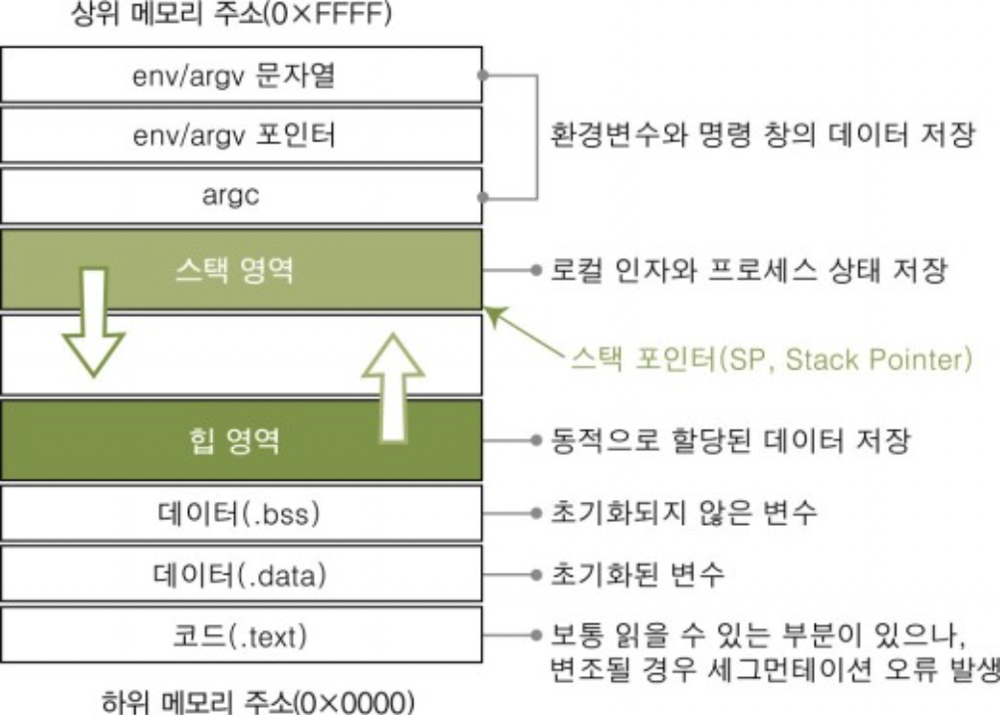

# 3.3.3 프로세스의 메모리구조

운영체제는 프로세스에 메모리를 할당할 때 다음의 구조를 기반으로 하며, 이러한 주소공간을 가상메모리라고 부른다.

### | Code와 Data

컴파일 단계에서 메모리를 할당하는 `정적할당`되는 영역이다.

<b> _Code 영역_ </b>

사용자가 작성한 프로그램 함수의 코드가 CPU에서 수행할 수 있는 기계어로 변환되어 저장되는 공간이다.

<b> _Data 영역_ </b>

전역 변수 혹은 static 변수 등 프로그램이 사용하는 데이터를 저장하는 공간이다.

0 이거나 어떠한 값으로도 초기화가 되어있지 않은 변수들은 `BSS segment`에 할당되고, 0이 아닌 값으로 초기화된 변수들은 `Data segment`에 할당된다.

 

### | Stack과 Heap

런타임 단계에서 메모리를 할당하는 `동적할당`되는 영역이다.

<b> _Stack 영역_ </b>

호출된 함수의 수행을 마치고, 복귀할 주소 및 데이터(지역변수, 매개변수, 리턴값 등)를 임시로 저장하는 공간이다.

해당 영역은 함수 호출 시 기록하고, 함수의 수행이 완료되면 사라진다.

컴파일 시 스택 영역의 크기가 결정되기 때문에, 무한히 할당할 수 없다. 따라서 재귀함수가 반복해서 호출되거나, 함수가 메모리를 초과할 정도로 지역변수를 많이 가지고 있다면 stack overflow가 발생한다.

<b> _Heap 영역_ </b>

프로그래머가 필요할 때 마다 사용하는 메모리 영역이다.

C에서는 malloc()과 calloc() 함수들을 사용하여 런타임에 메모리를 동적으로 생성하며, free()를 사용하여 동적으로 할당된 메모리를 해제할 수 있다.

특히 vector는 내부적으로 힙 영역을 사용한다.

> 여담이지만 코테 볼때는 malloc/free 쓰지 말고 전역변수로 할당할 수 없을 정도로 배열의 크기가 클 것 같으면 vector 쓰시는게...
