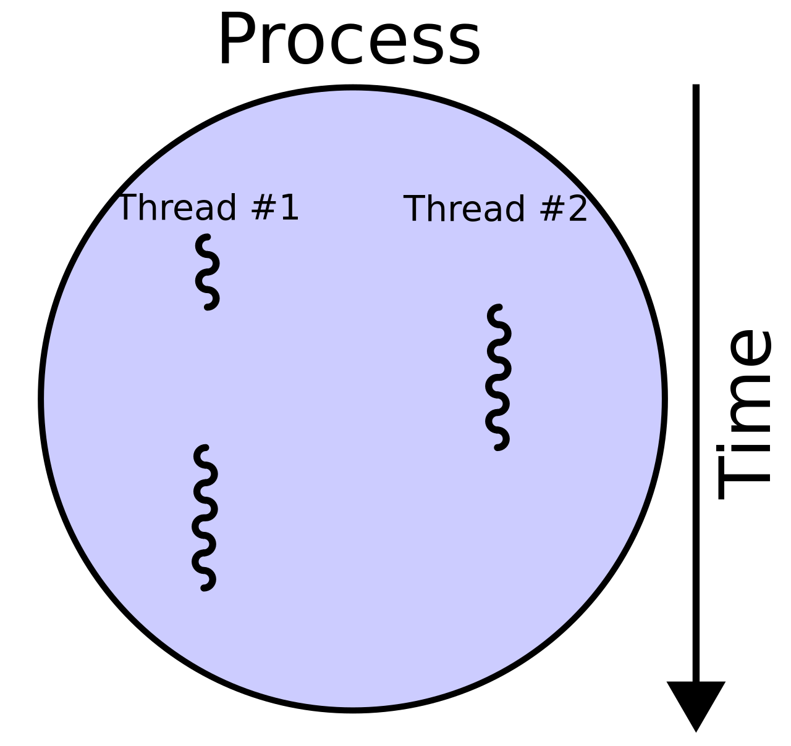

# 3.3.6 스레드와 멀티스레딩

### | 스레드(thread)

- 프로세스의 실행가능한 가장 작은 단위이다.

- 프로세스는 스레드를 여러개 가질 수 있다.

- 코드/데이터/스택/힙 영역을 각각 생성하는 프로세스와는 달리, 스레드는 코드/데이터/힙 영역을 서로 공유한다.

 

### | 멀티스레딩(multithreading)

- 프로세스 내 작업을 여러 개의 스레드로 처리하는 기법이다.
- 스레드끼리 서로 자원을 공유하기 때문에 효율적이다.
- 한 스레드가 중단(blocked)되어도 다른 스레드는 실행(running) 상태일 수 있기 때문에 무중단으로 빠른 처리가 가능하다.

<b> _멀티프로세스와 멀티스레드, 차이점은 ?_ </b>

| 멀티프로세스                                                     | 멀티스레드                                                                        |
| ---------------------------------------------------------------- | --------------------------------------------------------------------------------- |
| 여러 개의 CPU를 사용하여 여러 프로세스를 동시에 수행하는 것이다. | 하나의 프로세스 내에서 둘 이상의 스레드가 동시에 작업을 수행하는 것이다.          |
| 각 프로세스가 독립적인 메모리를 가지고 별도로 실행된다.          | 스레드가 자신이 속한 프로세스의 메모리를 공유한다.                                |
|                                                                  | 각 스레드가 자신이 속한 프로세스의 메모리를 공유하므로 시스템 자원의 낭비가 적다. |
