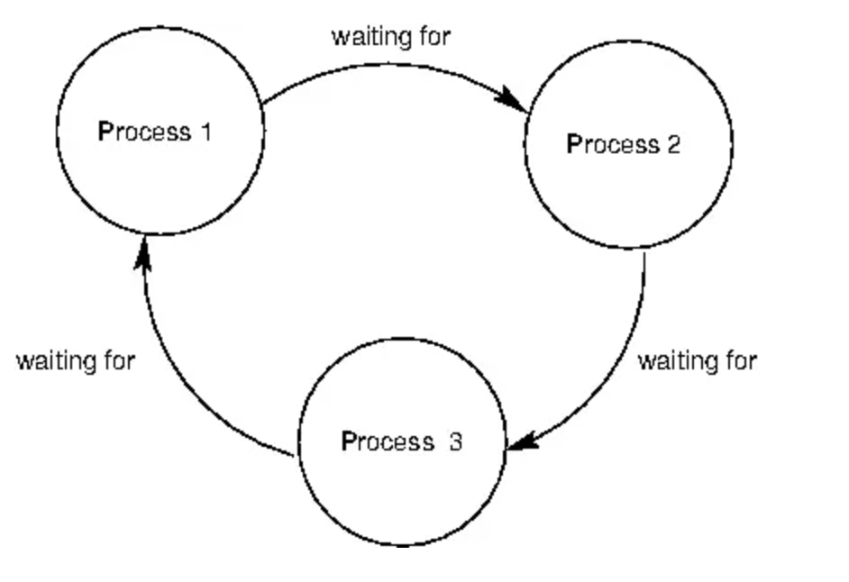

# 3.3.8 교착상태(deadlock)

잘못된 자원 관리로 인해 프로세스나 스레드들이 아무것도 진행하지 않은 상태로 영원히 서로를 기다리는 상황이다.

이는 멀티스레딩, 병렬 프로그래밍, 분산 컴퓨팅에서 흔히 발생된다.

### | 발생원인

아래 4가지 조건을 모두 만족해야 한다.

<b> _1. 상호 배제 (Mutual exclusion)_ </b>

자원은 동시에 사용할 수 없다.

만약 자원을 여럿이서 동시에 쓸 수 있다면 교착상태는 발생하지 않을 것이다. 한 프로세스가 자원을 독점하여 다른 프로세스들이 접근이 불가능해지기 때문에 발생한다.

<b> _2. 점유 상태로 대기 (Hold and wait)_ </b>

자원 하나를 붙잡은 상태에서 또 다른 자원을 기다린다.

2개 이상의 자원을 동시에 써야할 때 이것을 순차적으로 할당받은 경우, 그 중 일부의 자원을 다른 프로세스가 붙잡고 놔주지 않는다면 무한으로 대기해야 한다.

> (가)프로세스는 A, B 자원을 필요로 한다.  
> (나)프로세스는 A, B, C, D 자원을 필요로 하며 그 중 일부의 자원이 이미 사용중이므로 기다려야 한다.  
> 한편, (다)프로세스는 현재 아무도 사용하고 있지 않은 C, D 자원만 필요로 하지만 이미 (나)프로세스가 C, D 자원을 점유하고 있으므로 대기해야 한다.

<b> _3. 선점 불가 (No preemption)_ </b>

다른 프로세스의 자원을 강제로 가져올 수 없다.

<b> _4. 순환성 대기 (Circular wait)_ </b>



서로가 서로의 자원을 요구하는 상태에서, 마지막 프로세스가 첫 프로세스에서 사용중인 자원을 쓰기 위해 대기 중인 상황이다.

<br />

### | 해결방법

1. 4가지 발생조건 중 하나라도 방지하면 데드락을 예방할 수 있다.
2. `은행원 알고리즘`을 사용한다.
3. 사이클이 있는지 찾아보고, 이에 관련된 프로세스를 한개 씩 지운다.
4. 사용자가 알아서 작업을 종료한다. ('응답없음' 출현 시)
   > 저는 이걸 인텔리제이 돌릴때 가장 많이 한 것 같네요 .. ^^;

```
🥸 은행원 알고리즘이란 ?
프로세스 당 요청할 자원들의 최대치를 통해 자원 할당 가능 여부를 파악하는 알고리즘이다.
`자원의 총량`, `현재 할당된 자원량`을 기준으로 안정/불안정 상태로 나누어 안정 상태로 가도록 자원을 할당한다.
```
