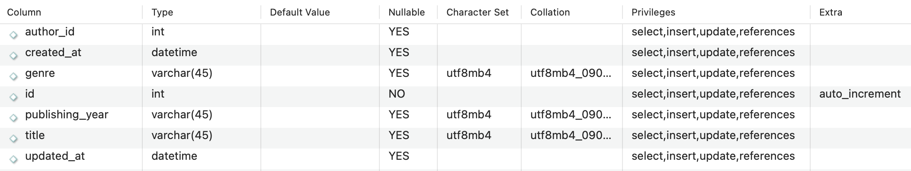

# 4.1.5 필드와 레코드

책 이라는 엔티티는 book 이라는 이름의 테이블로 속성인 아이디, 책제목, 저자아이디, 출판년도, 장르, 생성날짜, 업데이트 날짜 등의 `필드(field)`를 갖는다.  
(단, 보통 속성 이름은 영어로 함)

```sql
CREATE TABLE `cs`.`book` (
  `id` INT NOT NULL AUTO_INCREMENT,
  `title` VARCHAR(45) NULL,
  `author_id` INT NULL,
  `publishing_year` VARCHAR(45) NULL,
  `genre` VARCHAR(45) NULL,
  `created_at` DATETIME NULL,
  `updated_at` DATETIME NULL,
  PRIMARY KEY (`id`));
```



해당 테이블에 쌓이는 행 단위의 데이터를 `레코드(record, tuple이라고도 함)` 라고 한다.

<br />

### | 필드타입

모든 필드(컬럼)은 타입을 갖는다.

위의 book 테이블에서 id는 int이고 title은 varchar 이다.

Mysql을 기준으로 타입을 살펴보면 다음과 같다.

- <b> 숫자 </b> : TINYINT, SMALLINT, MEDIUMINT, INT, BIGINT

- <b> 날짜 </b> : DATE(날짜O/시간X), DATETIME(날짜O/시간O), TIMESTAMP(날짜O/시간O, time_zone에 의존)

```sql
-- datedemo 테이블 생성
create table datedemo
(
 mydatetime datetime,
 mytimestamp timestamp
);

-- insert 현재시간
insert into datedemo values(now(), now());

-- 데이터 확인
select * from datedemo;
+-----------------------+---------------------+
| mydatetime            | mytimestamp         |
+-----------------------+---------------------+
| 2023-08-06 22:52:45   | 2023-08-06 22:52:45 |
+-----------------------+---------------------+

-- timezone 변경
SET time_zone = '+01:00';

-- 데이터 재확인
select * from datedemo;
+-----------------------+---------------------+
| mydatetime            | mytimestamp         |
+-----------------------+---------------------+
| 2023-08-06 22:52:45   | 2023-08-06 14:52:45 |
+-----------------------+---------------------+
```

- <b> 문자 </b> : CHAR, VARCHAR, TEXT, BLOB, ENUM, SET

| CHAR                                                            | VARCHAR                                        |
| --------------------------------------------------------------- | ---------------------------------------------- |
| 고정 길이 문자열                                                | 가변 길이 문자열                               |
| 0 ~ 255                                                         | 0 ~ 65535                                      |
| 레코드를 저장할 때 무조건 선언한 길이 값으로 고정하여 저장된다. | 입력된 데이터에 따라 용량을 가변시켜 저장한다. |

> 공간 효율성을 위해 보통은 VARCHAR를 사용하는 것 같아요.

| TEXT                            | BLOB                                                                  |
| ------------------------------- | --------------------------------------------------------------------- |
| 큰 문자열 저장에 사용한다.      | 이미지, 동영상 등 큰 데이터 저장에 사용한다.                          |
| 게시판의 본문을 저장할 때 쓴다. | 보통은 S3를 이용하여 데이터를 저장하고, 그 경로를 VARCHAR로 저장한다. |

```
🥸 아마존 S3(AWS simple storage service) 란 ?
아마존 웹 서비스에서 제공하는 온라인 스토리지 웹 서비스이다.
```

| ENUM                                         | SET                                |
| -------------------------------------------- | ---------------------------------- |
| 단일 선택만 가능하다.                        | 여러 개의 데이터를 선택할 수 있다. |
| 값이 숫자로 매핑되어 메모리를 적게 사용한다. | 비트 단위의 연산을 할 수 있다.     |
| 최대 65535 개의 요소를 넣을 수 있다.         | 최대 64개의 요소를 넣을 수 있다.   |

> mysql에만 존재하는 데이터 타입으로, 사용을 권장하지는 않는 것 같습니다..  
> 인프라 개선 작업 등으로 인해 DB migration이 종종 일어나는데, 이때 my to ora 의 경우 해당 데이터 타입을 지원하지 않기 때문에 이슈가 발생할 수 있다고 합니다..  
> 대표적인 CDC(change data capture) 도구인 OGG 에서 enum 배열값 0(빈문자열 '')은 지원하지 않는다고 합니다.
