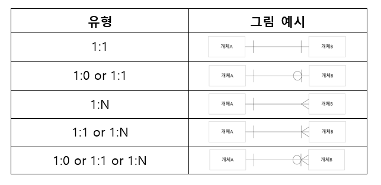

# 4.1.6 관계 (relation)

데이터베이스에서는 두 개의 엔티티 간 관계를 정의할 수 있다.

> 위의 그림은 IE 표기법이고, Barker 표기법은 개체 A에 파이프 기호가 없습니다.

 

### | 1:1 관계

대한민국 국민 한 사람 당 주민등록번호는 반드시 한 개 존재한다.

이 경우 1:1의 관계이다.

- 대한민국 국민(이름, 출생년도, 주소)
- 주민등록번호(이름, 주민번호)

1:1 관계는 테이블을 두 개로 분리하여 테이블의 구조를 더 이해하기 쉽게 만들어 준다.

### | 1:N 관계

TODO 앱을 만든다고 가정하자.

유저 한 명 당 여러개의 할일이 존재할 수 있다. 또한 할일이 없을 수 도 있다.

이 경우 1:N의 관계가 된다.

- 유저(이름, 아이디, 비밀번호)
- 할일(제목, 내용, 완료여부)

### | N:M 관계

학생과 강의의 관계를 살펴보자.

학생은 여러 개의 강의를 수강할 수 있고, 강의는 여러 명의 학생을 포함할 수 있다.

이 경우 N:M이 된다.

- 학생(이름, 학번, 전공)
- 학생\_강의(학번, 강의코드)
- 강의(강의코드, 강의명, 교수명)

N:M 관계는 두 테이블을 직접적으로 연결하지 않고, 중간에 테이블 하나를 끼워넣어 1:N, 1:M이라는 관계를 갖는 두 테이블로 나누어 설정한다.
