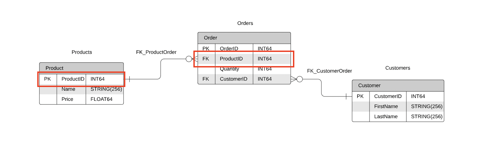

# 4.1.7 키(key)

테이블 간의 관계를 조금 더 명확하게 하고, 테이블 자체의 인덱스를 위해 설정된 장치이다.

```
🥸 인덱스 란 ?
DB의 테이블에 대한 동작 속도를 높여주는 자료구조로, 테이블 내 1개 이상의 컬럼을 이용하여 생성될 수 있다.
고속의 검색 동작 뿐 만 아니라 레코드 접근과 관련하여 효율적인 순서 매김 동작에 대한 기초를 제공한다.
```

<br />

### | 기본키(primary key, PK, 프라이머리 키)

`유일성`과 `최소성`을 만족하는 키이다.

- 테이블 내에서 중복 없이 고유하게 존재한다. => 유일성
- 두 칼럼을 합쳐 복합키로 만들지 않는다. => 최소성

따라서 기본키는 자연키 또는 인조키 중 하나로 설정한다.

<b> _자연키_ </b>

중복된 값을 제외하며 중복되지 않는 것을 "자연스럽게" 선별하다가 나오는 키이다.

자연키는 언젠가 변하는 속성을 갖는다.

> '서울에 사는 사람'이라는 테이블을 만든다고 가정해봅시다.  
> 이름, 성별, 나이, 주소, 주민등록번호 등등의 속성이 있을텐데요,  
> 김소연 동명이인만 적어도 300명은 될 것 같으니 이름 X  
> 여자분은 서울인구 절반정도는 될 것 같고  
> 나이는 말할것도 없고,  
> 가족끼리는 같은 주소에 거주하고 있으므로 안되고,  
> 이렇게 소거법으로 남은 속성 중 기본키가 될 수 있는 속성은 '주민등록번호' 뿐 !

<b> _인조키_ </b>

인위적으로 고유 식별자를 부여하여 생성되는 키이다.

자연키와는 대조적으로 변하지 않는다. 따라서 대부분 기본키는 인조키로 설정한다.

<br />

### | 외래키 (foreign key, FK)

다른 테이블의 기본키를 그대로 참조하는 값으로, 개체와의 관계를 식별하는데 사용된다.

외래키는 중복이 허용된다.

> 즉 주문 테이블에는 상품 아이디가 같은 여러 상품이 row 값으로 들어올 수 있다.



<br />

### | 후보키 (candidate key)

기본키가 될 수 있는 후보들이며 유일성과 최소성을 동시에 만족하는 키이다.

<br />

### | 대체키 (alternate key)

후보키가 두 개 이상일 경우 어느 하나를 기본키로 지정하고 남은 후보키들을 말한다.

<br />

### | 슈퍼키 (super key)

각 레코드를 유일하게 식별할 수 있는 유일성을 갖춘 키이다.

```
🍒 기본키와 슈퍼키의 차이점 ?
기본키는 최소성을 만족시켜야 하기 때문에 복합키를 사용하지 않는다.

한편, 슈퍼키는 하나 이상의 속성들의 집합으로 이루어진 것이다.
예컨대 {학번, 주민번호} {학번, 전화번호} {학번, 주민번호, 전화번호}는 수강생의 슈퍼키가 될 수 있다.
즉, 슈퍼키는 유일성은 만족하지만 최소성은 만족하지 못한다.
```
