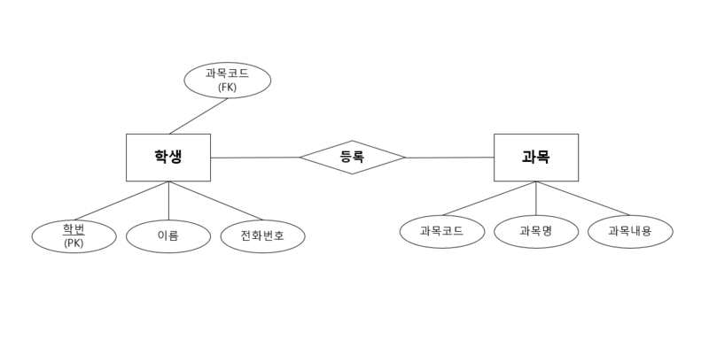

# 4.2.1 ERD의 중요성 

ERD는 시스템의 요구사항을 기반으로 작성되며, 이를 기반으로 데이터베이스를 구축한다. 

> 요구사항 &rarr; ERD &rarr; DB

데이터베이스를 구축한 이후에도 디버깅/프로세스 재설계시 설계도 역할을 한다. 

관계형 구조로 표현할 수 있는 데이터를 구성하는데는 유용할 수 있으나, 비정형 데이터(동영상, 오디오, 사진, 문서, 메일본문 등...)를 충분히 표현하기에는 부족하다. 

 

> 학생 엔티티는 학번, 이름, 전화번호라는 속성을 갖는다.             
> 과목 엔티티는 과목코드, 과목명, 과목내용 이라는 속성을 갖는다.               
> 두 엔티티 사이에는 '등록'이라는 관계가 정의되어 있다.             
> 이때 과목코드인 외래키를 통해 학생이 등록한 과목을 구분할 수 있다.               