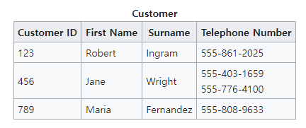
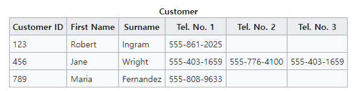
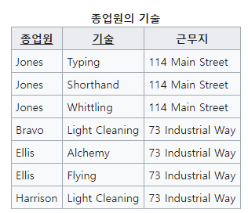
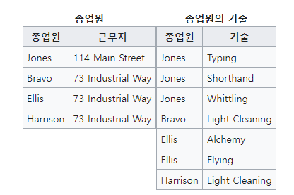
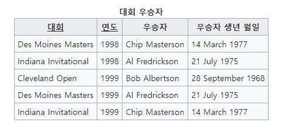
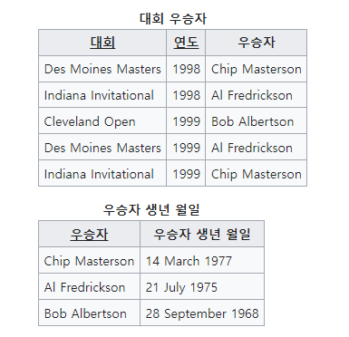
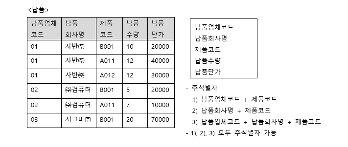
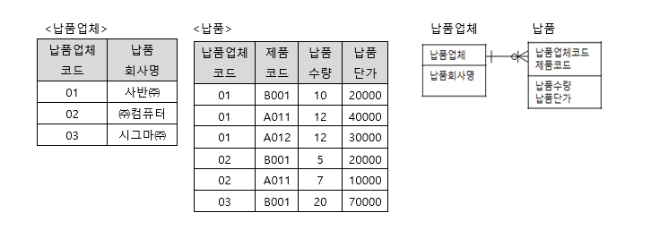

# 4.2.3 정규화(nomalization)

<b> _개념_ </b>

관계형 데이터베이스의 설계에서 `중복을 최소화`하게 데이터를 구조화하는 프로세스이다. 

정규화 과정은 정규형 원칙을 기반으로 정규형을 만들어가는 과정이며, 정규화의 정도는 정규형(NF, normal form)으로 표현한다. 

정규화를 한다고 해서 성능이 100% 좋아지는 것은 아니고, 조인이 요구되는 쿼리도 있으므로 서비스에 따라 선택하는 것이 필요하다. 

### | 제 1 정규형 

릴레이션의 모든 도메인이 더 이상 분해될 수 없는 `원자값(atomic value)`만으로 구성되어야 한다. 

릴레이션의 속성값 중 한 개의 기본키에 대하여 두 개 이상의 값을 가지는 반복 집합이 있어서는 안된다. 

> 쉽게 말해 한 필드에 하나의 값만 있어야 한다는 뜻 !

 

> jane의 phonenumber에 두 개의 전화번호가 있었는데, 이를 여러개의 전화번호 컬럼을 두어 한 필드에 데이터가 하나만 있도록 반복 집합을 제거하였다. 

 

### | 제 2 정규형 

릴레이션이 제 1 정규형이며, 부분 함수의 종속성을 제거한 형태를 말한다. 
 
즉, `릴레이션의 도메인이 원자값을 가지`(제1정규형 만족)면서 `기본키가 하나의 속성`인 것이다. 

> {종업원}이나 {기술}은 중복값이 있으므로 후보키가 될 수 없다. 오직 복합키 {종업원, 기술} 만이 이 테이블의 후보키가 될 수 있다.      
> (한편 복합키는 기본키가 될 수 없음)
> 한편 남은 속성인 {근무지}는 후보키의 일부분인 {종업원}에만 영향을 받는다. (종업원 &rarr; 근무지 : 부분적 함수 종속 관계)       
> 따라서 상기 테이블은 2NF가 아니다.         

> 2NF로 바꾸면 위와 같다.          
> {종업원} 후보키를 갖는 "종업원" 테이블과 {종업원, 기술} 후보키를 갖는 "종업원의 기술" 테이블이다. 

이때 주의해야할 점은 릴레이션을 동등하게 분해해야 한다는 것과, 정보 손실이 발생하지 않도록 해야한다는 점이다. 

 

### | 제 3 정규형 

제 2 정규형이고, 기본키가 아닌 모든 속성이 이행적 함수 종속을 만족하지 않는 상태를 말한다. 

즉 기본키는 하나의 속성을 가지며, 테이블 내의 모든 속성이 기본키에만 의존하며 다른 후보키에 의존하지 않는 상태를 말한다. 

<b> _이행적 함수 종속_ </b>

논리적으로 A &rarr; B && B &rarr; C => A &rarr; C 가 성립하는데, 이때 집합 C가 집합 A에 이행적으로 함수 종속이 되었다고 한다. 

       
> (14 March 1977에 태어난 사람은 Chip Masterson임) && (Chip Masterson은 Des Moines Masters에서 우승함) => (14 March 1977에 태어난 사람은 Des Moines Masters에서 우승함) : 이행적 함수 종속 만족하는 상태이므로 정규화가 필요하다.       

 

### | 보이스/코드 정규형 (BCNF)

제 3 정규형이고, 릴레이션의 함수 종속 관계에서 모든 결정자가 후보키인 상태를 말한다. 

즉 식별자로 쓰이는 속성이 일반 속성에 종속되지 않아야 한다는 것이다. 

> 이 경우, 만약 사반(주) 에서 새로운 제품을 납품하면 납품업체코드와 납품회사명을 중복으로 입력해야 한다.        
> 납품회사명을 수정하려면 중복되는 모든 데이터를 수정해야 한다.                 
> 제품코드가 B001이면서 납품업체 코드가 03인 데이터를 삭제하면 납품회사명도 삭제된다.        
> 즉 사명도 식별자인데, {제품코드, 납품업체코드}에 종속되고 있다.       

