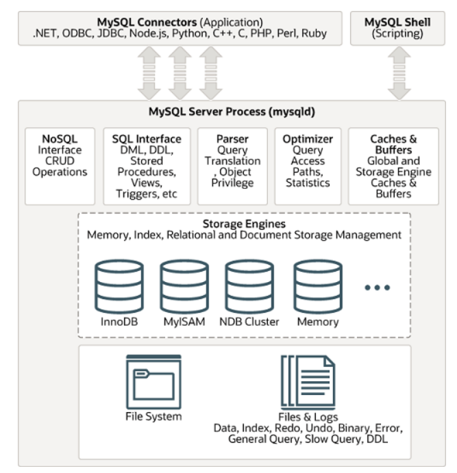
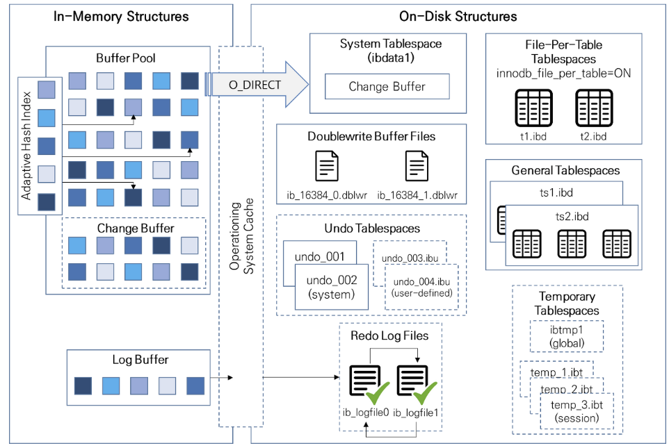

# 4.4.1 관계형 데이터베이스 (RDBMS)

행과 열을 가지는 표 형식으로 데이터를 저장하는 방식을 따르며, SQL 언어를 통해 조작한다. 

MySQL, Oracle, PostgreSQL, SQL server, MSSQL 등이 이에 속한다. 

이들의 경우 표준 SQL을 따르지만 각 제품에 따라 조금씩 특화된 쿼리언어를 사용하다. 

### | MySQL

대부분의 운영체제와 호환되며 현재 가장 많이 사용되는 데이터베이스이다. 

다음과 같은 특징을 갖는다. 

- C, C++로 구축 
- MyISAM 인덱스 압축 기술
- B-tree 기반의 인덱스
- 스레드 기반의 메모리 할당 시스템 
- 매우 빠른 조인 
- 최대 64개의 인덱스 제공 

 

<b> _스토리지 엔진_ </b>

DB 엔진이라고도 불리며, 서버 엔진이 필요한 물리적인 데이터를 가져오는 장치를 의미한다. 

즉, 데이터를 삽입/추출/업데이트/삭제(CRUD) 하는데 사용되는 기본 소프트웨어이다. 

- MySQL 8.0부터 기본 스토리지 엔진으로 사용되고 있는 InnoDB의 모습이다. 
- `BufferPool` 은 디스크 상의 데이터나 인덱스 정보를 메모리에 캐시해두기 위한 공간이다. 이를 통해 디스크 I/O를 줄일 수 있다.

<b> _커넥터_ </b>

스토리지 엔진 위에는 커넥터API 및 서비스 계층을 두어 MySQL DB와 쉽게 통신할 수 있도록 한다. 

<b> _쿼리캐시_ </b>

SELECT 쿼리의 결과를 캐싱해주는 기능이다. (MySQL 8.0 버전부터는 제거됨 ...)

이는 자주 변경되지 않은 테이블이 존재하고, 서버가 동일한 쿼리를 여러번 받는 환경에서 유용하게 사용될 수 있다. 

 

### | PostgreSQL

MySQL에 비해 SQL 표준을 더 잘 지원하고, 기능이 강력하며 쿼리가 복잡해질 수록 성능이 더 잘나오는 특징을 가진 데이터베이스이다. 

대신 기본적인 CRUD 성능은 MySQL에 비해 낮다. 

Extension을 통해 자유롭게 기능추가가 가능하다. 

> 이래서 개발자들 선호가 꾸준히 높아지나 봅니다...          
> 최근에는 인공지능 연구를 위한 벡터 기반의 데이터를 다루는 확장기능도 활발하게 공개되고 있답니다. 

