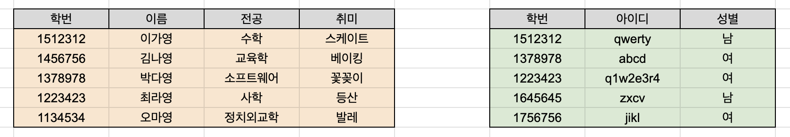

# 4.6.1 내부조인(inner join)


교집합 연산과 같다.

왼쪽 테이블과 오른쪽 테이블에 모두 일치하는 행이 있으면 결과로 출력한다.

```sql
SELECT *    # 모두 선택해라
FROM LEFT AS L  # LEFT(별칭 L) 라는 테이블과
INNER JOIN RIGHT AS R # RIGHT(별칭 R) 라는 테이블에서
ON L.keycol = R.keycol; # L의 keycol의 값과 R의 keycol의 값이 같은 행들을
```



