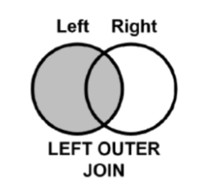
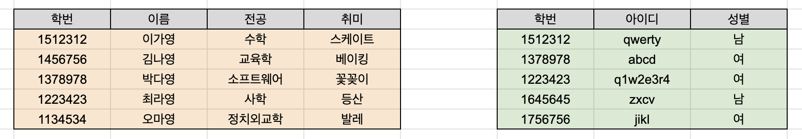
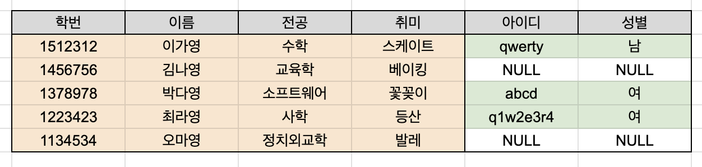

# 4.6.2 왼쪽조인(left outer join)



왼쪽 테이블을 기준으로 JOIN하는 것으로, 왼쪽 테이블의 모든 행이 결과 테이블에 표기된다.

만약 왼쪽 테이블에 일치하는 항목이 없다면 NULL 값이 된다.

```sql
SELECT *
FROM LEFT AS L
LEFT JOIN RIGHT AS R
ON L.keycol = R.keycol;
```



