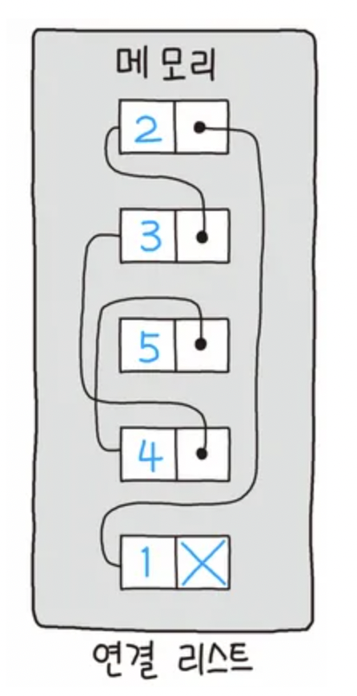

# 5.2.1 연결리스트



<b> _개요_ </b>

prev 포인터와 next 포인터로 앞과 뒤의 노드를 연결시킨 자료구조이다.

<b> _장점_ </b>

- 노드를 포인터로 연결하여 공간효율성을 극대화한 자료구조이다.
- 데이터의 삽입과 삭제가 용이하다. O(1)
- 메모리 공간을 필요한 만큼 사용 가능하다(필요시 새노드를 기존 리스트에 연결하여 확장 가능).

<b> _단점_ </b>

- 자료번호가 없이 그저 연결관계만 있기 때문에 특정 노드를 불러내기 어렵다.
- 데이터의 탐색속도가 떨어진다. O(n)

<br />

### | 단순 연결 연결리스트 (singly linked list)


next 포인터(다음 노드에 대한 참조)만 가진 가장 단순한 형태의 연결리스트이다.

보통 queue를 구현할 때 이 방법을 쓴다.

<br />

### | 이중 연결리스트 (doubly linked list)


next 포인터와 prev 포인터(이전 노드의 참조)를 갖는다.

```cpp
#include <cstdio>
#include <list>
#include <iterator>


std::list<int> List;

int main () {
    // 0부터 9까지 뒤에서 삽입
    // 0 1 2 3 4 5 6 7 8 9
    for (int i = 0; i < 10; i++) List.push_back(i);
    // 0부터 9까지 앞에서 삽입
    // 9 8 7 6 5 4 3 2 1 0 0 1 2 3 4 5 6 7 8 9
    for (int i = 0; i < 10; i++) List.push_front(i);

    // pos라는 list iterator(포인터, 반복자) 선언
    // 처음 위치는 List 가장 앞 원소
    std::list<int>::iterator pos = List.begin();
    // 한칸 뒤로 옮겨줌
    pos++;
    printf("%d\n", *pos); // 8

    // 앞에서 두번째 위치에 1000을 삽입
    List.insert(pos, 1000);

    // for문 돌면서 List의 모든 원소 출력
    for (auto iter : List){
        printf("%d ", iter);
    }
    printf("\n==================================\n");

    // List의 가장 앞에 있는 원소 pop (리스트에서 원소 삭제됨)
    List.pop_front();

    // List의 가장 뒤에 있는 원소 pop (")
    List.pop_front();

    // iterator로 List 순회하는 다른 방법
    for (auto iter = List.begin(); iter != List.end(); iter++) {
        printf("%d ", *iter);
    }

    return 0;
}

/*
8
9 1000 8 7 6 5 4 3 2 1 0 0 1 2 3 4 5 6 7 8 9
==================================
8 7 6 5 4 3 2 1 0 0 1 2 3 4 5 6 7 8 9
*/
```

- push_front() : 앞에서부터 요소 삽입
- push_back() : 뒤에서부터 요소 삽입
- insert() : 중간에 요소 삽입

<br />

### | 순환 연결리스트 (circular linked list)

이중 연결리스트와 같지만, 마지막 노드의 next 포인터가 헤드 노드를 가리키는 형태이다.

<br />

---

### 연결리스트 연습에 좋은 문제

| 사이트   | 문제번호 | 문제이름          |
| -------- | -------- | ----------------- |
| 백준     | 2307     | 도로검문          |
| 백준     | 10282    | 해킹              |
| 코드트리 |          | 산타의 선물공장 2 |
| 백준     | 1238     | 파티              |
| 백준     | 1753     | 최단경로          |
| 백준     | 17471    | 게리맨더링        |
| 백준     | 1162     | 도로포장          |
| 백준     | 10217    | KCM Travel        |
| 백준     | 1068     | 트리              |
| 백준     | 15681    | 트리와 쿼리       |
